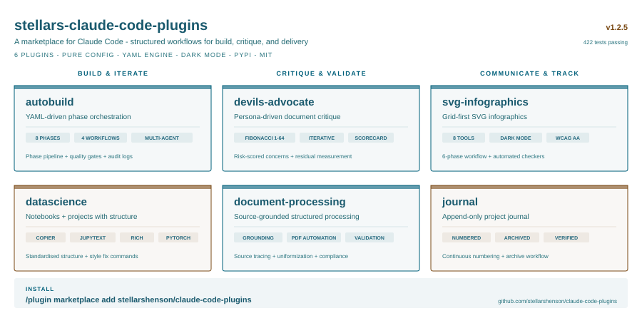
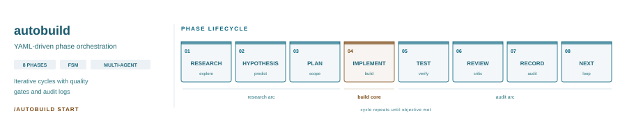
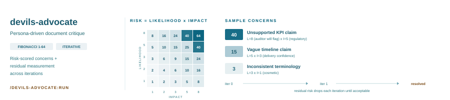
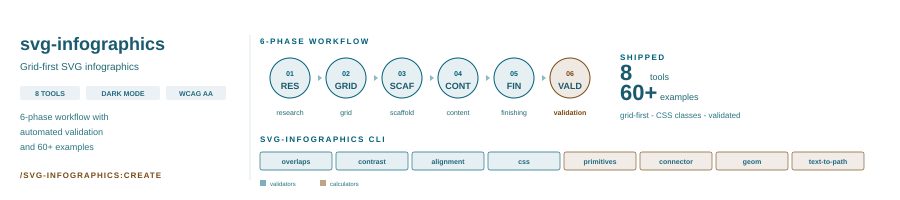
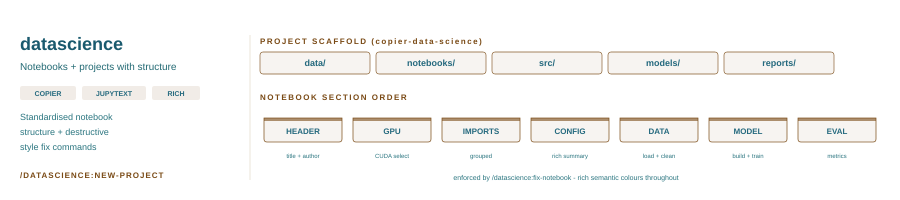
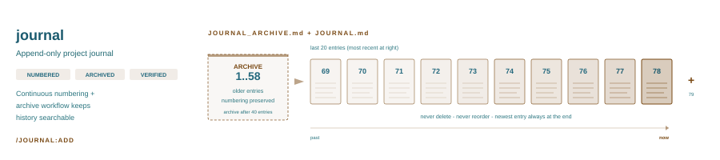
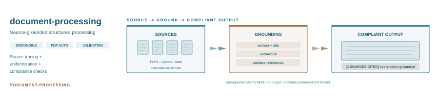

# stellars-claude-code-plugins

[](https://github.com/stellarshenson/claude-code-plugins/actions/workflows/ci.yml)
[](https://pypi.org/project/stellars-claude-code-plugins/)
[](https://pepy.tech/project/stellars-claude-code-plugins)
[](https://www.python.org/downloads/)



## Your AI agent will cut corners. This is the forcing function.

You ask Claude to "improve error handling." Claude says "Fixed it." Two files changed, no tests run, edge cases broken. Or it ships an SVG infographic with overlapping text and contrast failures. Or it passes a document past a reviewer who'd tear it apart.

This marketplace makes Claude work like a disciplined engineer instead. Each plugin enforces a specific discipline: research before implement, validate before ship, ground every claim, audit every iteration.

```bash
# Force Claude through research, plan, test, review, and audit before claiming done
/autobuild:run improve error handling in the API layer

#  -> writes PROGRAM.md (objective + scope)
#  -> writes BENCHMARK.md (measurable score)
#  -> asks for your approval
#  -> implements
#  -> runs tests
#  -> reviews against the benchmark
#  -> records evidence in YAML audit log
```

```bash
/plugin marketplace add stellarshenson/claude-code-plugins
/plugin install autobuild@stellarshenson-marketplace
```

Read the long-form articles: [Your AI Agent Will Cut Corners. Here's How to Stop It](https://medium.com/@konradwitowskijele/your-ai-agent-will-cut-corners-heres-how-to-stop-it-40f3bc7a4762) and [Stop Fixing Your AI's SVGs](https://medium.com/towards-artificial-intelligence/stop-fixing-your-ai-svgs-715df70ccca0). For real examples (60+ production SVGs, 4 worked devils-advocate analyses, 3 autobuild iteration trajectories, a 1.0-CV grounding result), see [`showcase/`](showcase/).

## The full marketplace - seven disciplines

`autobuild` is the spear. The same forcing-function logic powers six more plugins, each enforcing a different kind of discipline on Claude. Install them individually or as a bundle.

| Plugin | What it solves |
|--------|---------------|
| [autobuild](autobuild/) | Executes code and artefact builds toward an objective with iterations driven by a calculated outcome benchmark - enforces structured phases with multi-agent review |
| [devils-advocate](devils-advocate/) | Produces high-quality documents for a specific audience using a scientific, measured, iterative approach - quantified critique with Fibonacci risk scoring and per-iteration residual measurement. Also red-teams code and artefacts via `adversarial-review` - fresh context-free `claude -p` reviewers, eleven expert adversaries, multi-round until a confirming pass is clean |
| [svg-infographics](svg-infographics/) | Produces high-quality standardised SVG infographics - grid-first design, theme-driven styling, dark/light mode, 5 routing modes (straight/L/L-chamfer/spline/manifold) with A* auto-routing, callout placement solver, chart generation, and 6 automated checkers |
| [datascience](datascience/) | Produces high-quality data science projects and notebooks following consistent standards - scaffolds projects from copier templates, enforces notebook structure, applies rich output styling, and supports prompt engineering techniques |
| [document-processing](document-processing/) | Processes documents according to user requests with grounding in source materials - source tracing, compliance checking, PDF automation |
| [journal](journal/) | Produces a work journal marking key changes, implementations, and decisions - append-only audit trail with continuous numbering, archiving, and deterministic `journal-tools` CLI for validation, sorting, and word-count enforcement |
| [project-management](project-management/) | Tracks acceptance criteria and defects for the project inside the repository - permanent ids, mandatory triage, authored append-only logs, and reports computed on read by the deterministic `pm-tools` CLI |

```bash
# Add the marketplace once
/plugin marketplace add stellarshenson/claude-code-plugins

# Install all seven
/plugin install autobuild@stellarshenson-marketplace
/plugin install devils-advocate@stellarshenson-marketplace
/plugin install svg-infographics@stellarshenson-marketplace
/plugin install datascience@stellarshenson-marketplace
/plugin install document-processing@stellarshenson-marketplace
/plugin install journal@stellarshenson-marketplace
/plugin install project-management@stellarshenson-marketplace
```

## autobuild



Runs structured multi-iteration development cycles where each iteration passes through a full phase lifecycle with quality gates. A program defines what to build, a benchmark measures progress, and the engine enforces the workflow until the objective is met or iterations are exhausted.

- **Shallow fixes** - forces research and hypothesis before implementation
- **Scope creep** - plan locks scope, review catches deviations
- **Lost context** - hypothesis catalogue and failure context persist across iterations
- **Unchecked quality** - two independent gates (readback + gatekeeper) per phase
- **No accountability** - every phase records agents, outputs, and verdicts in YAML audit logs
- **Benchmark gaming** - guardian agent checks for benchmark-specific tuning vs genuine improvement

**Skills**: `autobuild` (orchestrator), `program-writer`, `benchmark-writer`

### Workflow types

| Type | Phases | Use when |
|------|--------|----------|
| `full` | RESEARCH → HYPOTHESIS → PLAN → IMPLEMENT → TEST → REVIEW → RECORD → NEXT | Feature work, improvements |
| `fast` | PLAN → IMPLEMENT → TEST → REVIEW → RECORD → NEXT | Clear objective, no exploration needed |
| `gc` | PLAN → IMPLEMENT → TEST → RECORD → NEXT | Cleanup, refactoring |
| `hotfix` | IMPLEMENT → TEST → RECORD | Targeted bug fix |
| `planning` | RESEARCH → PLAN → RECORD → NEXT | Work breakdown (auto-chains before full) |

### Usage

```bash
# Describe what you want - the plugin handles the rest
/autobuild improve error handling in the API layer
```

The plugin writes PROGRAM.md and BENCHMARK.md from your prompt, asks you to approve, then runs the orchestrator autonomously.

See [autobuild/README.md](autobuild/) for the full phase lifecycle, agent architecture, and configuration details.

## devils-advocate



Systematically critiques documents from the perspective of their toughest audience. Builds a devil persona, harvests verifiable facts, generates a risk-scored concern catalogue, and iterates corrections until residual risk is acceptable.

**Skills**: `setup` (build persona + fact repository), `evaluate` (concern catalogue + baseline scorecard), `iterate` (apply corrections or re-score), `run` (full workflow end-to-end), `adversarial-review` (hostile review of code and artefacts)

Risk scoring uses a Fibonacci scale (1-8) for likelihood and impact, producing risk scores from 1-64. Each concern is scored 0-100% on how well the document addresses it, and the residual risk (what remains unaddressed) drives iteration priority.

`adversarial-review` turns the same hostility on code. It spawns fresh, context-free `claude -p` subprocesses as reviewers - Mode 1 hunts bugs inside a diff (no tools, one turn); Mode 2 audits the whole repo with tools on for the rot that lives between files (hardcodings, config drift, broken separation of concerns). Eleven pluggable adversaries supply the expert lens - `architect`, `bug-hunter`, `qa-engineer`, `analyst`, `ux-designer`, `tui`, `data-scientist`, `methodologist`, `popular-science`, `devops`, `slop-hunter` - and any adversary runs in either mode. Reviews are multi-round: find, fix, then re-confirm clean, and the panel caps at 3 lenses unless you ask for more.

### Usage

```bash
# Full end-to-end workflow
/devils-advocate:run

# Step by step
/devils-advocate:setup       # Build persona, harvest facts
/devils-advocate:evaluate    # Generate concerns + baseline scorecard
/devils-advocate:iterate     # Apply corrections, re-score (repeat)

# Red-team a change or a repo
/devils-advocate:adversarial-review the auth middleware change before I merge
```

See [devils-advocate/README.md](devils-advocate/) for scoring formula details, artefact format, the full concern catalogue methodology, and the adversary roster.

## svg-infographics



Creates production-quality SVG infographics with a mandatory 6-phase workflow (research, grid, scaffold, content, finishing, validation). Every coordinate is Python-calculated, every colour traces to an approved theme swatch, and six validation tools check overlaps, WCAG contrast, alignment, connector quality, CSS compliance, and pairwise connector collisions before delivery.

Five connector routing modes (`straight`, `l`, `l-chamfer`, `spline`, `manifold`) with grid A* auto-routing around obstacles, container-scoped routing within specific shapes, straight-line collapse for near-aligned endpoints, and stem preservation guaranteeing clean cardinal segments behind arrowheads. Callout placement via greedy solver with leader and leaderless modes. Charts via pygal with dual light/dark palette and WCAG contrast audit.

**Boolean / margin operations** on path shapes (`boolean` calculator): headless Inkscape Path menu - `union`, `intersection`, `difference`, `xor` (Exclusion) plus one-step `buffer` (Inset / Outset), `cutout` (cut-with-margin: subtract B inflated by N units from A), and `outline` (closed annulus of width N around a shape's boundary). The cutout-with-margin and outline-as-band ops are not exposed as one-button operations by Inkscape, Illustrator, Affinity, Figma, Sketch, or CorelDRAW - bundling them as primitives is the main agentic value-add. Operates polygon-only via `shapely`; Bezier / Arc inputs flatten to polylines, with the lossy round-trip surfaced as a CURVE-FLATTENED warning through the gate. Supports `--replace-id ID` for in-place rewrite of a named element's `d=` attribute.

**Stop-and-think warning-ack gate**: every producer tool (`calc_connector`, `charts`, `drawio_shapes`, `empty-space`, `finalize`) blocks its primary output whenever any warning fires. The caller must acknowledge each warning explicitly with `--ack-warning TOKEN=reason` - one flag per warning, terse reasoning required, no bulk override. Tokens are deterministic per invocation so reruns reproduce them. Forces a conscious per-finding decision instead of letting warnings scroll past unread.

**Skills**: `svg-designer` (fork-context design agent with tool palette, 6-phase workflow, design rules, validation gates), `theme` (palette approval + swatch generation)

### Usage

```bash
# Create infographic(s) with full workflow
/svg-infographics:create card grid showing 4 platform modules

# Generate theme swatch for approval
/svg-infographics:theme corporate blue palette

# Run validation on existing SVGs
/svg-infographics:validate docs/images/*.svg

# Fix issues in existing SVGs (layout / style / contrast / connectors / all)
/svg-infographics:fix docs/images/overview.svg style
/svg-infographics:fix docs/images/overview.svg layout

# Additive decoration pass on existing SVGs
/svg-infographics:beautify docs/images/overview.svg medium
```

Includes 60+ production SVG examples, 13 CLI tools (6 validators + 7 calculators including the boolean / margin ops), and theme swatches. See [svg-infographics/README.md](svg-infographics/) for the capability groups and workflow details.

## datascience



Enforces data science project standards derived from production notebook workflows. Five skills auto-trigger when working with notebooks, datasets, rich output, prompts, or progress bars. Nine commands fix existing code, scaffold new projects, and apply prompt engineering techniques.

**Skills**: `datascience` (project conventions), `notebook-standards` (section order, GPU-first, rich colours + equation references), `prompt-engineering` (7 research-backed techniques), `progressbars` (tqdm/rich), `hypothesis` (experiments log + SOTA doc, pre-registered fanout of the next round via persona generators)

### Usage

```bash
# Create a new project from copier template
/datascience:new-project

# Fix an existing notebook to comply with standards
/datascience:fix-notebook notebooks/01-kj-analysis.py

# Apply rich styling fixes (wrong colors, multiple prints)
/datascience:apply-style notebooks/02-kj-train.py

# Add or fix progress bars (choose tqdm or rich)
/datascience:apply-progressbar notebooks/02-kj-train.py

# Update a prompt by applying a technique (CoT, CoD, ToT, few-shot, etc.)
/datascience:update-prompt

# Full psychological prompting stack for hard problems
/datascience:challenge

# Port legacy project to copier-data-science template
/datascience:fix-project
```

See [datascience/README.md](datascience/) for the full list of standards enforced.

## journal



Project journal management with append-only entry format, continuous numbering, and automatic archiving. Auto-triggers on journal-related phrases (see below) or after substantive work, maintaining a consistent audit trail in `.claude/JOURNAL.md`. Includes a deterministic `journal-tools` CLI for validation, sorting, and word-count enforcement — the three pure-string subcommands run with no generative AI in the loop, and `standardize` orchestrates a focused `claude -p` subprocess per offender to repair word-count drift on entries `check` warned on.

**Skill**: `journal` (auto-triggered by the phrases below or after finishing substantive work)

### Auto-trigger phrases

| Command | Triggers on |
|---------|-------------|
| `/journal:update` | "update journal", "add journal entry", "add entry", "log this", "journal this", "record this in the journal" |
| `/journal:create` | "create journal", "init journal", "start journal", "new journal" (refuses if file already exists) |
| `/journal:archive` | "archive journal", "prune journal", "compact journal" (auto-suggests when >40 entries) |
| `/journal:standardize` | "standardize journal", "fix journal entry tiers", "repair journal" (run after `journal-tools check` reports word-count warnings) |

Clear split: `create` = scaffold-from-empty one-time, `update` = every write after that (append new entry or extend the last one), `archive` = runs the CLI archiver, `standardize` = ACP-driven word-count repair (oversized Standard → mark Extended or condense; oversized Extended → condense; spurious marker → drop).

### Usage

```bash
# Add a new entry — use this for 99% of journal writes
/journal:update added retry logic to API client

# Initialise a fresh journal (only when JOURNAL.md does not yet exist)
/journal:create backfill from this session

# Archive older entries (keeps last 20 in main, appends rest to JOURNAL_ARCHIVE.md)
/journal:archive

# Validate format, numbering, and word counts (deterministic CLI)
journal-tools check .claude/JOURNAL.md

# Re-number entries sequentially (fixes gaps or reorders)
journal-tools sort .claude/JOURNAL.md --dry-run

# Repair word-count drift via an ACP `claude -p` subprocess per offender
/journal:standardize    # chains: list -> per-entry prompt -> apply decision
```

Two word-count tiers: **Standard** (~70-120 words, the default) and **Extended** (~250-350 words, ONLY when the user explicitly asks or the work is an architectural decision / platform migration / multi-iteration debug). The checker emits warnings (not errors) when entries exceed the standard target or the extended max — length is a nudge, never a block.

See [journal/README.md](journal/) for entry format, CLI tools, and archiving rules.

## project-management

Acceptance criteria and defects tracked inside the repository, as markdown checklists the whole team can read and git can merge. Sized for a repository, a personal project or a small team - it removes the second system without pretending to be Jira.

**Skill**: `project-management` (auto-triggered on "acceptance criteria", "acc crit", "defects list", "bug tracker", "file a bug", "what is still open")

The design goal is that nothing is recorded twice, so nothing can drift out of step. The item text, its checkbox and its category are stored once each; the next free id, the backlinks, the category index and the test-coverage table are computed on read. There is deliberately no contents table, no Open / Fixed sections and no reverse links - each would be a second copy of something the file already knows.

- **Permanent ids** - `ACC-AUTH-102`, `DEF-LNCH-3`. Unique across the document, never renumbered, never recycled; an item that moves category keeps the code it was born with
- **Three states** - `[ ]` open, `[x]` closed, `[-]` rejected with a mandatory reason. A defect nobody will fix is a close; a report that was never a defect is a reject, so it does not come back next quarter as news
- **Mandatory triage** - `CRITICAL` / `MAJOR` / `MEDIUM` / `MINOR`, assigned by the agent as the defect is filed. `add` refuses an untriaged defect and `check` errors on one
- **Authored append-only logs** - ISO 8601 UTC, then the handle, then the event, including the attempts that FAILED and why. That record of what is already ruled out is the reason the file is worth keeping
- **`check` is a gate** - non-zero exit on a duplicate id, an untriaged defect, a hand-kept contents table or the wrong hint line; `--strict` also fails on warnings

### Usage

```bash
# Add or work a criterion
/project-management:acc-crit add a criterion that the session times out after 30 idle minutes

# File a defect - the agent triages it as it files
/project-management:defect auth token empty on the first turn after a fork

# The tables the user reads: SUMMARY, coverage, and the open fix queue
/project-management:report where do the defects stand

# Hostile review - analyst on criteria, qa-engineer on defects
/project-management:review the acc-crit doc before the sprint starts

# Migrate a legacy document to the schema (dry run first, always)
/project-management:upgrade docs/acceptance-criteria.md

# Direct CLI
pm-tools report docs --category AUTH --detail
pm-tools check docs --strict
```

See [project-management/README.md](project-management/) for the item format, the CLI surface, and the report semantics.

## document-processing



Structured document processing with source grounding and quality control. Takes input documents through a verified workflow (analyze, draft, ground, uniformize) and produces outputs where every factual claim is traceable to source material.

**Skills** (each pairs with a same-named command): `process` (build a deliverable from sources - 4-phase workflow), `grounding` (the one verification flow - runs the CLI; single claim / one document / batch via `source_map.yaml`; no compliance), `validate` (grounding + tone/style/length/format compliance), `update` (update an existing output, with a mandatory CLI-grounding closing pass), `pdf` (toolkit - extract / merge / split / forms / OCR / batch). Grounding is delegated, not duplicated: `validate`, `process`'s verify phase, and `update`'s closing step all call the `grounding` skill.

**CLI**: ships the `document-processing` command with lexical-mode grounding (default, CPU-only, torch-free): a frozen-weight logistic over 13-18 signals selected by effort tier (low / medium / high, default high). Validated macro-F1 0.817 on private RAG / 0.691 on VitaminC; ~165 ms/claim warm CPU. Every hit returns line / column / paragraph / page / context snippet — the agent cites without rereading. **Saves tokens: measured 64-86% reduction vs batched generative grounding** on real sources. Semantic retrieval + NLI entailment are opt-in via `pip install 'stellars-claude-code-plugins[semantic]'` + `document-processing setup`. The whole `document-processing` CLI needs **Python 3.12 exactly** - its engine (`groundrails`) pins `~=3.12.0` and is skipped by an environment marker on every other interpreter, so on 3.11 or 3.13 no subcommand runs, lexical included. The other five CLIs run across the toolkit's full **Python 3.11+** band.

**Native source format support** (Release F+): `.txt`, `.md`, `.rst`, `.pdf` (text), `.docx`, `.odt`, `.rtf`, `.html` extracted directly via pypdf / python-docx / odfpy / striprtf. Scanned PDFs go through a deterministic fallback chain: same-stem sibling lookup (`.ocr.txt` > `.txt` > `.docx` > ...) → optional auto-OCR via `[ocr]` extras (pytesseract + pdf2image + system tesseract; agent supplies `--ocr-lang`) → vision-OCR by Claude via the Read tool with `<stem>.ocr.txt` save convention. Auto-OCR results are quality-banded (good / candidate / failed) with a deterministic stop-and-think gate that surfaces per-source warnings the agent must ack with reasoning before grounding consumes the text.

**Data-science validated**: the shipped lexical manifold was validated on a held-out private RAG dataset (macro-F1 0.817, 2752 gold) and VitaminC (0.691), with 0.808 zero-shot on the Liu 2023 / Ye 2024 / Han 2024 academic fixtures. For the deterministic cascade archive (six-iteration `autobuild` cycle, CV mean accuracy 1.0, same three academic papers), see [`references/grounding-results/`](references/grounding-results/) and [`references/README.md`](references/README.md). Current lexical manifold experiment results: [`docs/experiments/lexical-grounding-sota.md`](docs/experiments/lexical-grounding-sota.md).

### Usage

```bash
# Build a deliverable from input documents
/document-processing:process synthesize expert opinions into position paper

# Update existing output with new source material (re-grounds the changed content)
/document-processing:update add new hearing transcript to timeline

# Validate a document against rules and against its sources
/document-processing:validate

# Bare grounding - single claim, one document, or a batch via source_map.yaml
/document-processing:grounding

# First-run: interactive opt-in prompt for optional semantic grounding
document-processing setup

# Direct CLI: ground a single claim (all four layers when semantic enabled)
document-processing ground \
  --claim "Kubernetes runs on 12 nodes" \
  --source docs/source.md \
  --threshold 0.85 --bm25-threshold 0.5 --semantic-threshold 0.85 --json

# Batch ground N claims from JSON, force semantic on for this call
document-processing ground \
  --manifest validation/claims.json \
  --source docs/source.md \
  --output validation/grounding-report.md \
  --semantic
```

See [document-processing/README.md](document-processing/) for the grounding methodology, folder structure, and PDF processing details.

## Install

The library ships the deterministic CLIs that every plugin depends on — install it alongside the plugin marketplace. Without the library the skills fall back to manual work and lose all automation.

```bash
pip install stellars-claude-code-plugins
```

Provides these binaries:

| Binary | Used by |
|--------|---------|
| `orchestrate` | `autobuild` |
| `svg-infographics` | `svg-infographics`, `devils-advocate` (visuals) |
| `render-png` | `svg-infographics` (Playwright-based SVG → PNG) |
| `journal-tools` | `journal` (check / sort / archive / standardize) |
| `pm-tools` | `project-management` (report / check / add / close / reject / upgrade) |
| `document-processing` | `document-processing` (ground / ground, three-layer grounding) |

As a Claude Code plugin marketplace:

```bash
/plugin marketplace add stellarshenson/claude-code-plugins
```

## Building a new plugin

Plugins are pure configuration - no Python code required. Create a directory with skills and register it in the marketplace:

```
my-plugin/
  .claude-plugin/plugin.json           # Plugin registration and skill triggers
  skills/
    my-skill/SKILL.md                  # Skill definition with description and instructions
```

The `plugin.json` registers your skills with Claude Code, defining when they trigger and what tools they have access to. Each `SKILL.md` contains the instructions Claude follows when the skill is invoked. The shared orchestration engine (`pip install stellars-claude-code-plugins`) provides the `orchestrate` CLI command that handles state management, FSM transitions, gate execution, and audit logging.

Register your plugin in the marketplace by adding an entry to `.claude-plugin/marketplace.json`.

## Development

```bash
make install          # create venv, install deps, editable install
make test             # run tests
make lint             # ruff format + check
make format           # auto-fix formatting
make build            # clean, test, bump version, build wheel
make publish          # build + twine upload to PyPI
```

## License

MIT License
