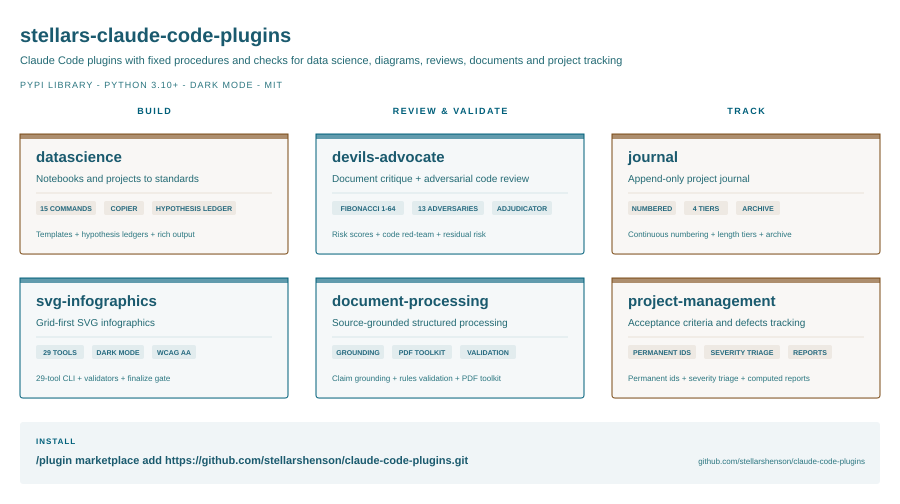
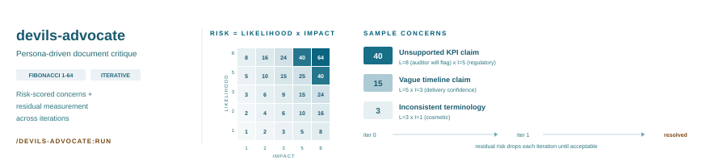
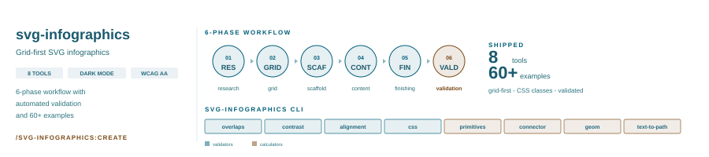
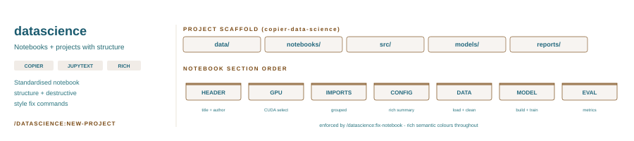
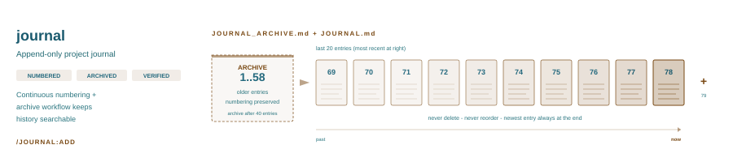
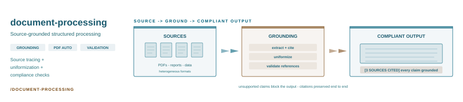

# stellars-claude-code-plugins

[](https://github.com/stellarshenson/claude-code-plugins/actions/workflows/ci.yml)
[](https://pypi.org/project/stellars-claude-code-plugins/)
[](https://pepy.tech/project/stellars-claude-code-plugins)
[](https://www.python.org/downloads/)

## Overview

This repository is a Claude Code plugin marketplace. It contains the plugins and a Python library, `stellars-claude-code-plugins`, whose command-line tools the plugins call. Each plugin gives Claude a set procedure for one kind of work, with checks it has to pass before it reports the work as done. The plugins cover acceptance criteria and defects, data science projects, SVG diagrams, document critique and code review, grounding claims in their sources, and a project journal.



```bash
# Add the marketplace, then install the plugins
/plugin marketplace add https://github.com/stellarshenson/claude-code-plugins.git
/plugin install project-management@stellarshenson-marketplace
/plugin install devils-advocate@stellarshenson-marketplace
/plugin install svg-infographics@stellarshenson-marketplace
/plugin install datascience@stellarshenson-marketplace
/plugin install document-processing@stellarshenson-marketplace
/plugin install journal@stellarshenson-marketplace
```

```bash
# Example: file a defect; the agent assigns its id and severity as it files
/project-management:defect auth token empty on the first turn after a fork
```

An article describes the SVG approach: [Stop Fixing Your AI's SVGs](https://medium.com/towards-artificial-intelligence/stop-fixing-your-ai-svgs-715df70ccca0). Worked examples are in [`showcase/`](docs/showcase/): 60+ production SVGs, 4 devils-advocate analyses and a grounding run with a cross-validated mean accuracy of 1.0.

## Plugins

The table lists what each plugin does. [Install](#install) adds the marketplace first, then the plugins.

| Plugin | What it solves |
|--------|---------------|
| [project-management](plugins/project-management/) | Tracks acceptance criteria and defects for the project inside the repository - permanent ids, mandatory triage, authored append-only logs, and reports computed on read by the deterministic `pm-tools` CLI |
| [devils-advocate](plugins/devils-advocate/) | Produces high-quality documents for a specific audience using a scientific, measured, iterative approach - quantified critique with Fibonacci risk scoring and per-iteration residual measurement. Also red-teams code and artefacts via `adversarial-review` - fresh context-free reviewer subagents, pluggable expert adversaries, an adjudicator that turns findings into one change plan, multi-round until a confirming pass is clean |
| [svg-infographics](plugins/svg-infographics/) | Produces high-quality standardised SVG infographics - grid-first design, theme-driven styling, dark/light mode, 5 routing modes (straight/L/L-chamfer/spline/manifold) with A* auto-routing, callout placement solver, chart generation, and 6 automated checkers |
| [datascience](plugins/datascience/) | Produces high-quality data science projects and notebooks following consistent standards - scaffolds projects from copier templates, enforces notebook structure, applies rich output styling, keeps hypothesis ledgers, a paper library and dataset records, writes popular-science explainers, and supports prompt engineering techniques |
| [document-processing](plugins/document-processing/) | Processes documents according to user requests with grounding in source materials - source tracing, compliance checking, PDF automation |
| [journal](plugins/journal/) | Produces a work journal marking key changes, implementations, and decisions - append-only audit trail with continuous numbering, archiving, article extraction for oversized entries, and deterministic `journal-tools` CLI for validation, sorting, and word-count enforcement |

## project-management

Acceptance criteria and defects tracked inside the repository, as markdown checklists the whole team can read and git can merge. Sized for a repository, a personal project or a small team - it removes the second system without pretending to be Jira.

**Skill**: `project-management` (auto-triggered on "acceptance criteria", "acc crit", "defects list", "bug tracker", "file a bug", "what is still open")

The design goal is that nothing is recorded twice, so nothing can drift out of step. The item text, its checkbox and its category are stored once each; the next free id, the backlinks, the category index and the test-coverage table are computed on read. There is deliberately no contents table, no Open / Fixed sections and no reverse links - each would be a second copy of something the file already knows.

- **Permanent ids** - `ACC-AUTH-102`, `DEF-LNCH-3`. Unique across the document, never renumbered, never recycled; an item that moves category keeps the code it was born with
- **Three states** - `[ ]` open, `[x]` closed, `[-]` rejected with a mandatory reason. A defect nobody will fix is a close; a report that was never a defect is a reject, so it does not come back next quarter as news
- **Mandatory triage** - `CRITICAL` / `MAJOR` / `MEDIUM` / `MINOR`, assigned by the agent as the defect is filed. `add` refuses an untriaged defect and `check` errors on one
- **Authored append-only logs** - ISO 8601 UTC, then the handle, then the event, including the attempts that FAILED and why. That record of what is already ruled out is the reason the file is worth keeping
- **`check` is a gate** - non-zero exit on a duplicate id, an untriaged defect, a hand-kept contents table or the wrong hint line; `--strict` also fails on warnings
- **Relations and search** - `relate` records related, blocking and overriding items, writes an override on both items and removes the older link when a new one closes a cycle; `refs` prints what points at an id and its blocker chain, `search` ranks items by BM25 relevance, and `list` / `pivot` build ad-hoc tables; `check` errors on a relation to a missing id, on a blocked-by or override cycle and on an override written on one item only
- **Regressions, locks and attachments** - `reopen` on a closed defect opens a numbered regression (`DEF-LNCH-3-1`) and keeps the closure's proof; `lock` marks an item as being worked on; `attach` records a file with its checksum
- **Hand edits are logged** - the guard hook stops a hand edit of a tracker until `pm-tools ack` logs its reason in `pm-hand-edits.md`

### Usage

```bash
# Add or work a criterion
/project-management:acc-crit add a criterion that the session times out after 30 idle minutes

# File a defect - the agent triages it as it files
/project-management:defect auth token empty on the first turn after a fork

# The tables the user reads: SUMMARY, coverage, and the open fix queue
/project-management:report where do the defects stand

# Hostile review - analyst on criteria, qa-engineer on defects
/project-management:review the acc-crit doc before the sprint starts

# Migrate a legacy document to the schema (dry run first, always)
/project-management:upgrade docs/acceptance-criteria.md

# Direct CLI
pm-tools report docs --category AUTH --detail
pm-tools check docs --strict
```

See [plugins/project-management/README.md](plugins/project-management/) for the item format, the CLI surface, and the report semantics.

## devils-advocate



Systematically critiques documents from the perspective of their toughest audience. Builds a devil persona, harvests verifiable facts, generates a risk-scored concern catalogue, and iterates corrections until residual risk is acceptable.

**Skills**: `setup` (build persona + fact repository), `evaluate` (concern catalogue + baseline scorecard), `iterate` (apply corrections or re-score), `run` (full workflow end-to-end), `improve` (now step 1 of `iterate`), `adversarial-review` (hostile review of code and artefacts). **Agents**: `adversarial-reviewer`, `adjudicator`. **CLI**: `review-tools` - reviewer dossier, merged findings table, per-round cost, adversary research cache

Risk scoring uses a Fibonacci scale (1-8) for likelihood and impact, producing risk scores from 1-64. Each concern is scored 0-100% on how well the document addresses it, and the residual risk (what remains unaddressed) drives iteration priority.

`adversarial-review` turns the same hostility on code. It spawns fresh, context-free reviewer subagents, or `claude -p` subprocesses where tools must be denied - Mode 1 hunts bugs inside a diff (no tools, one turn); Mode 2 audits the whole repo with tools on for the rot that lives between files (hardcodings, config drift, broken separation of concerns). Pluggable adversaries supply the expert lens - `architect`, `bug-hunter`, `qa-engineer`, `analyst`, `ux-designer`, `tui`, `data-scientist`, `methodologist`, `popular-science`, `devops`, `slop-hunter`, `ai-engineer`, `digital-marketer` - and any adversary runs in either mode. Reviews are multi-round: find, fix, then re-confirm clean, and the panel caps at 3 lenses unless you ask for more. The `adjudicator` turns each round's findings into one change plan grouped by root cause, and the shipped `adversarial-loop.js` workflow runs the rounds until a confirming round is clean.

### Advantages over ad hoc review

This section compares `adversarial-review` with an ad hoc adversarial review, where the session or a generic subagent is asked to attack a change and continue until nothing is left.

| Area | Plugin | Ad hoc review |
|---|---|---|
| Reviewer | A fresh agent with one of 13 expert lenses. Each lens has its own method and a file of rules with their sources. The reviewer never sees the author's reasoning for the change | The author's own session, or a generic agent told to be critical |
| Findings | Each finding carries a severity, `file:line`, the input that reproduces it, who is harmed and the smallest fix. Findings from all lenses merge into one table | Prose reports, merged by hand |
| Scope | A bar states the product's purpose, its inputs and its main use path. The script caps a finding outside the bar at MINOR | No stated scope, so every input counts |
| Fixes | An adjudicator turns the findings into one change plan grouped by root cause. It removes a fix that caused new findings before it refines it, and it flags each fix that adds a new mechanism so the user can reject it | Every reviewer suggestion becomes code |
| Repeat rounds | A confirming round reads only the applied patches. The script discards taste, findings outside the fix and findings already ruled | Every round reviews the whole target again |
| Target | Nothing edits the code during a round. The main session applies the plan between rounds | The code changes while it is reviewed |
| End | The loop ends on a clean round, an adjudicator stop, a round cap, or when the adjudicator judges the loop spiralling in two of the last three rounds. A round whose reviewers all died is reported, never counted as clean | The loop ends when someone stops it |
| Discovery | `review-tools dossier` builds the Python file, symbol and CLI inventory by AST in seconds, and a code graph answers callers and dependents | Each reviewer finds the same facts with its own reads and searches |
| Cost | `review-tools cost` reports turns, tokens and time per lens and per round | The cost is unknown |

Real review runs measured these effects:

- **Scope** - without a bar, one loop rated a `<select>` pasted into a notebook cell MAJOR and spent most of a 1.41M-token run refining a fix that the user then deleted
- **Fixes** - a manual 8-round loop without adjudication grew its target from 302 to 537 lines, and the user stopped it at round 8. In two recent reviews of this repository the adjudicator refuted 6 and 8 findings as immaterial
- **Repeat rounds** - confirming rounds took 13-15 turns, whole-repo reviews 67-115. Before the ruled-finding filter, 34 of 80 confirming findings repeated an earlier ruling
- **Target** - the manual 8-round loop rewrote its target during the review
- **End** - two recent reviews of this repository ended clean at round 3, with 10, 3, 1 and 9, 2, 0 findings per round
- **Discovery** - across 69 whole-repo reviews, each reviewer spent 40-60 of its 67-115 turns rediscovering the same inventory
- **Cost** - the same 69 reviews used 9-16M cached tokens each, and file content was 1-2% of that, so the number of turns sets the cost

### Usage

```bash
# Review a change with named adversaries
/devils-advocate:adversarial-review architect and bug-hunter on the auth middleware change before I merge
```

See [plugins/devils-advocate/README.md](plugins/devils-advocate/) for scoring formula details, artefact format, the full concern catalogue methodology, and the adversary roster.

## svg-infographics



Creates production-quality SVG infographics with a mandatory 6-phase workflow (research, grid, scaffold, content, finishing, validation). Every coordinate is Python-calculated, every colour traces to an approved theme swatch, and six validation tools check overlaps, WCAG contrast, alignment, connector quality, CSS compliance, and pairwise connector collisions before delivery.

Five connector routing modes (`straight`, `l`, `l-chamfer`, `spline`, `manifold`) with grid A* auto-routing around obstacles, container-scoped routing within specific shapes, straight-line collapse for near-aligned endpoints, and stem preservation guaranteeing clean cardinal segments behind arrowheads. Callout placement via greedy solver with leader and leaderless modes. Charts via pygal with dual light/dark palette and WCAG contrast audit.

**Boolean / margin operations** on path shapes (`boolean` calculator): headless Inkscape Path menu - `union`, `intersection`, `difference`, `xor` (Exclusion) plus one-step `buffer` (Inset / Outset), `cutout` (cut-with-margin: subtract B inflated by N units from A), and `outline` (closed annulus of width N around a shape's boundary). The cutout-with-margin and outline-as-band ops are not exposed as one-button operations by Inkscape, Illustrator, Affinity, Figma, Sketch, or CorelDRAW - bundling them as primitives is the main agentic value-add. Operates polygon-only via `shapely`; Bezier / Arc inputs flatten to polylines, with the lossy round-trip surfaced as a CURVE-FLATTENED warning through the gate. Supports `--replace-id ID` for in-place rewrite of a named element's `d=` attribute.

**Stop-and-think warning-ack gate**: every producer tool (`calc_connector`, `charts`, `drawio_shapes`, `empty-space`, `finalize`) blocks its primary output whenever any warning fires. The caller must acknowledge each warning explicitly with `--ack-warning TOKEN=reason` - one flag per warning, terse reasoning required, no bulk override. Tokens are deterministic per invocation so reruns reproduce them. Forces a conscious per-finding decision instead of letting warnings scroll past unread.

**Skills**: `svg-infographics` (fork-context design agent with tool palette, 6-phase workflow, design rules, validation gates), `theme` (palette approval + swatch generation), and `create`, `fix`, `validate`, `beautify`, `export-png` behind their same-named commands. **Agent**: `svg-builder` - builds, fixes and validates one graphic; `create` dispatches one per graphic to build a deck in parallel

The standalone validators `overlaps`, `contrast`, `alignment` and `connectors` exit 0 when they report findings; `--strict` makes them exit 1 for a script that gates on the result.

### Usage

```bash
# Describe the graphic
/svg-infographics:create card grid showing 4 platform modules

# Or name the document the graphics are for
/svg-infographics:create docs/architecture.md

# Add decoration to an existing graphic (low, medium, high or absurd)
/svg-infographics:beautify docs/images/overview.svg medium
```

Includes 60+ production SVG examples, the `svg-infographics` CLI with 29 subcommands (workflow gates, validators, calculators including the boolean / margin ops, draw.io shapes, icons and backgrounds), and theme swatches. See [plugins/svg-infographics/README.md](plugins/svg-infographics/) for the capability groups and workflow details.

## datascience



Enforces data science project standards derived from production notebook workflows. Its skills auto-trigger when working with notebooks, datasets, rich output, prompts, progress bars, footnotes, hypotheses or cited papers. Fifteen commands scaffold projects and notebooks, fix and review existing code, record experiments, papers and datasets, write explainers, and apply prompt engineering techniques.

**Skills**: `datascience` (project conventions), `notebook-standards` (section order, GPU-first, rich colours + equation references), `prompt-engineering` (7 research-backed techniques), `progressbars` (tqdm/rich), `hypothesis` (experiments log + SOTA doc, pre-registered fanout of the next round via persona generators), `footnotes` (Jupyter-compatible anchor footnotes), `papers` (download each cited source and write its digest into `references/papers/`), `dataset` (acquire a dataset with a licence and provenance record), `popular-science` (explainers for a non-specialist reader). **CLI**: `hypothesis-tools` - ids, registration, results, verdicts and checks for the experiments log

### Usage

```bash
# Create a new project from copier template
/datascience:new-project

# Fix an existing notebook to comply with standards
/datascience:fix-notebook notebooks/01-kj-analysis.py

# Apply rich styling fixes (wrong colors, multiple prints)
/datascience:apply-style notebooks/02-kj-train.py

# Add or fix progress bars (choose tqdm or rich)
/datascience:apply-progressbar notebooks/02-kj-train.py

# Update a prompt by applying a technique (CoT, CoD, ToT, few-shot, etc.)
/datascience:update-prompt

# Full psychological prompting stack for hard problems
/datascience:challenge

# Port legacy project to copier-data-science template
/datascience:fix-project

# Create a notebook with the standard structure, or review one against the standards
/datascience:notebook
/datascience:review notebooks/02-kj-train.py

# Add or fix footnotes
/datascience:apply-footnotes notebooks/02-kj-train.py

# Record a hypothesis, its experiment and its verdict
/datascience:hypothesis

# Download a cited paper and write its digest
/datascience:papers

# Acquire a dataset with its licence and provenance record
/datascience:dataset

# Write a popular-science explainer from a result
/datascience:popular-science

# Hostile review with the adversary a data science project needs
/datascience:adversarial-review
```

See [plugins/datascience/README.md](plugins/datascience/) for the full list of standards enforced.

## journal



Project journal management with append-only entry format, continuous numbering, and automatic archiving. Auto-triggers on journal-related phrases (see below) or after substantive work, maintaining a consistent audit trail in `.claude/JOURNAL.md`. Includes a deterministic `journal-tools` CLI for validation, sorting, and word-count enforcement — the three pure-string subcommands run with no generative AI in the loop, and `standardize` orchestrates a focused `claude -p` subprocess per offender to repair word-count drift on entries `check` warned on.

**Skill**: `journal` (auto-triggered by the phrases below or after finishing substantive work)

### Auto-trigger phrases

| Command | Triggers on |
|---------|-------------|
| `/journal:update` | "update journal", "add journal entry", "add entry", "log this", "journal this", "record this in the journal" |
| `/journal:create` | "create journal", "init journal", "start journal", "new journal" (refuses if file already exists) |
| `/journal:archive` | "archive journal", "prune journal", "compact journal" (auto-suggests when >40 entries) |
| `/journal:standardize` | "standardize journal", "fix journal entry tiers", "repair journal" (run after `journal-tools check` reports word-count warnings) |
| `/journal:article` | "create article from entry", "extract journal entry to article", "make article from journal" (run when an entry is over 400 words) |

Clear split: `create` = scaffold-from-empty one-time, `update` = every write after that (append new entry or extend the last one), `archive` = runs the CLI archiver, `standardize` = ACP-driven word-count repair (oversized Standard → mark Extended or condense; oversized Extended → condense; spurious marker → drop), `article` = moves an oversized entry's depth into a `docs/` article and leaves a Standard summary that links to it.

### Usage

```bash
# Add a new entry — use this for 99% of journal writes
/journal:update added retry logic to API client

# Initialise a fresh journal (only when JOURNAL.md does not yet exist)
/journal:create backfill from this session

# Archive older entries (keeps last 20 in main, appends rest to JOURNAL_ARCHIVE.md)
/journal:archive

# Validate format, numbering, and word counts (deterministic CLI)
journal-tools check .claude/JOURNAL.md

# Re-number entries sequentially (fixes gaps or reorders)
journal-tools sort .claude/JOURNAL.md --dry-run

# Repair word-count drift via an ACP `claude -p` subprocess per offender
/journal:standardize    # chains: list -> per-entry prompt -> apply decision

# Move an entry over 400 words into a docs/ article
/journal:article 42
```

Four tiers: **Short** (under 50 words, marked `[Short]`, for trivial changes), **Standard** (50-150 words, the default), **Extended** (150-400 words, marked `[Extended]`, ONLY when the user explicitly asks or the work is an architectural decision / platform migration / multi-iteration debug) and **Article** (over 400 words - `/journal:article` moves the depth to `docs/`). The checker emits warnings (not errors) when entries exceed the standard target or the extended max — length is a nudge, never a block.

See [plugins/journal/README.md](plugins/journal/) for entry format, CLI tools, and archiving rules.

## document-processing



Structured document processing with source grounding and quality control. Takes input documents through a verified workflow (analyze, draft, ground, uniformize) and produces outputs where every factual claim is traceable to source material.

**Skills** (each pairs with a same-named command): `process` (build a deliverable from sources - 4-phase workflow), `grounding` (the one verification flow - runs the CLI; single claim / one document / batch via `source_map.yaml`; no compliance), `validate` (grounding + tone/style/length/format compliance), `update` (update an existing output, with a mandatory CLI-grounding closing pass), `pdf` (toolkit - extract / merge / split / forms / OCR / batch). Grounding is delegated, not duplicated: `validate`, `process`'s verify phase, and `update`'s closing step all call the `grounding` skill.

**CLI**: ships the `document-processing` command with lexical-mode grounding (default, CPU-only, torch-free): a frozen-weight logistic over 13-18 signals selected by effort tier (low / medium / high, default high). Validated macro-F1 0.817 on private RAG / 0.691 on VitaminC; ~165 ms/claim warm CPU. Every hit returns line / column / paragraph / page / context snippet — the agent cites without rereading. **Saves tokens: measured 64-86% reduction vs batched generative grounding** on real sources. Semantic retrieval + NLI entailment are opt-in via `pip install 'stellars-claude-code-plugins[semantic]'` + `document-processing setup`. The whole `document-processing` CLI needs **Python 3.12 exactly** - its engine (`groundrails`) pins `~=3.12.0` and is skipped by an environment marker on every other interpreter, so on 3.10, 3.11 or 3.13 no subcommand runs, lexical included. The other seven CLIs run across the toolkit's full **Python 3.10+** band.

**Native source format support** (Release F+): `.txt`, `.md`, `.rst`, `.pdf` (text), `.docx`, `.odt`, `.rtf`, `.html` extracted directly via pypdf / python-docx / odfpy / striprtf. Scanned PDFs go through a deterministic fallback chain: same-stem sibling lookup (`.ocr.txt` > `.txt` > `.docx` > ...) → optional auto-OCR via `[ocr]` extras (pytesseract + pdf2image + system tesseract; agent supplies `--ocr-lang`) → vision-OCR by Claude via the Read tool with `<stem>.ocr.txt` save convention. Auto-OCR results are quality-banded (good / candidate / failed) with a deterministic stop-and-think gate that surfaces per-source warnings the agent must ack with reasoning before grounding consumes the text.

**Data-science validated**: the shipped lexical manifold was validated on a held-out private RAG dataset (macro-F1 0.817, 2752 gold) and VitaminC (0.691), with 0.808 zero-shot on the Liu 2023 / Ye 2024 / Han 2024 academic fixtures. For the deterministic cascade archive (six-iteration `autobuild` cycle, CV mean accuracy 1.0, same three academic papers), see [`references/grounding-results/`](references/grounding-results/) and [`references/README.md`](references/README.md). Current lexical manifold experiment results: [`docs/experiments/lexical-grounding-sota.md`](docs/experiments/lexical-grounding-sota.md).

### Usage

```bash
# Build a deliverable from input documents
/document-processing:process synthesize expert opinions into position paper

# Update existing output with new source material (re-grounds the changed content)
/document-processing:update add new hearing transcript to timeline

# Validate a document against rules and against its sources
/document-processing:validate

# Bare grounding - single claim, one document, or a batch via source_map.yaml
/document-processing:grounding

# PDF toolkit - extract text and tables, merge, split, fill forms, OCR, batch
/document-processing:pdf merge the three hearing transcripts into one PDF

# First-run: interactive opt-in prompt for optional semantic grounding
document-processing setup

# Direct CLI: ground a single claim (all four layers when semantic enabled)
document-processing ground \
  --claim "Kubernetes runs on 12 nodes" \
  --source docs/source.md \
  --threshold 0.85 --bm25-threshold 0.5 --semantic-threshold 0.85 --json

# Batch ground N claims from JSON, force semantic on for this call
document-processing ground \
  --manifest validation/claims.json \
  --source docs/source.md \
  --output validation/grounding-report.md \
  --semantic
```

See [plugins/document-processing/README.md](plugins/document-processing/) for the grounding methodology, folder structure, and PDF processing details.

## Install

In Claude Code, add the marketplace first, then install the plugins:

```bash
# 1. Add the marketplace - the HTTPS URL clones without a GitHub SSH key
/plugin marketplace add https://github.com/stellarshenson/claude-code-plugins.git

# 2. Install the plugins
/plugin install project-management@stellarshenson-marketplace
/plugin install devils-advocate@stellarshenson-marketplace
/plugin install svg-infographics@stellarshenson-marketplace
/plugin install datascience@stellarshenson-marketplace
/plugin install document-processing@stellarshenson-marketplace
/plugin install journal@stellarshenson-marketplace
```

The plugins drive the deterministic CLIs in the library. Each skill that calls one installs or upgrades the library first; without it the skills fall back to manual work. To install it yourself:

```bash
pip install stellars-claude-code-plugins
```

Provides these binaries:

| Binary | Used by |
|--------|---------|
| `svg-infographics` | `svg-infographics`, `devils-advocate` (visuals) |
| `render-png` | `svg-infographics` (Playwright-based SVG → PNG) |
| `journal-tools` | `journal` (check / sort / archive / standardize) |
| `pm-tools` | `project-management` (report / list / pivot / search / refs / check / add / edit / close / reject / reopen / relate / ack / upgrade) |
| `hypothesis-tools` | `datascience` (`hypothesis` - experiments log ids, results, verdicts, check) |
| `review-tools` | `devils-advocate` (`adversarial-review` - dossier / findings / cost / research / prompt) |
| `document-processing` | `document-processing` (ground / validate / extract-claims / check-consistency / setup / calibrate / config / train-lexical) |

## Building a new plugin

Plugins are pure configuration - no Python code required. Create a directory with skills and register it in the marketplace:

```
my-plugin/
  .claude-plugin/plugin.json           # Plugin registration and skill triggers
  skills/
    my-skill/SKILL.md                  # Skill definition with description and instructions
```

The `plugin.json` registers your skills with Claude Code, defining when they trigger and what tools they have access to. Each `SKILL.md` contains the instructions Claude follows when the skill is invoked. The shared orchestration engine (`pip install stellars-claude-code-plugins`) provides the `orchestrate` CLI command that handles state management, FSM transitions, gate execution, and audit logging.

Register your plugin in the marketplace by adding an entry to `.claude-plugin/marketplace.json`.

## Development

```bash
make install          # create venv, install deps, editable install
make test             # run tests
make lint             # ruff format + check
make format           # auto-fix formatting
make build            # clean, test, bump version, build wheel
make publish          # build + twine upload to PyPI
```

## License

MIT License

<!-- marks:settings panel=hidden -->
