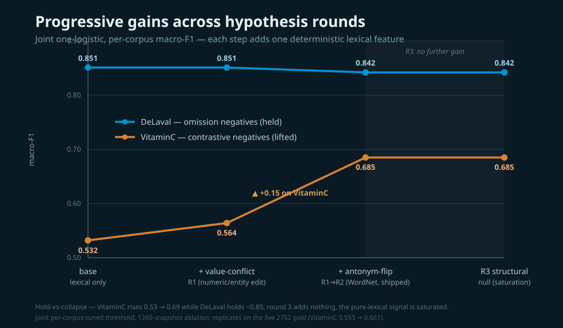

# Deterministic cross-lingual grounding on the private RAG gold

Experiment on the `experiment/grounding` branch: build a non-LLM grounder that classifies each claim as supported or hallucination on a real cross-lingual dataset, without training any model on the test fold. The current best is a **lexical-only logistic** (translate the claim, then word recall) - no semantic model. Artefacts: `experiments/grounding/{harness.py, lab.py, HYPOTHESIS.md, RESEARCH.md, RESULTS.md, BENCHMARK.md}`; the labelled gold and transcripts stay in a git-ignored stash.

## Situational overview

The lexical grounder confirmed only ~12% of supported claims on the client gold; re-profiling overturned the team's "semantic is required" conclusion - and the final model needs no semantic layer at all.

- **Dataset (live)** - 2752 verified records `{claim, source_text, label, lang, user_id, trace_id}` (parquet, dual-judge verified from 639 production conversations), **1966 supported / 786 hallucination (29%)**, evidence always an English-dominant document dump. The gold grew 375 → 856 → 1260 → 2631 → 2752 mid-experiment; several conclusions changed with it (the depth-2 GBT that won on 375 overfits on the larger sets)
- **Cohort caveat (evaluated pooled)** - the 29% hallucination rate is `~10% organic + a QA/test cohort's adversarial sessions`: two test accounts hold 1118 records / 623 of the 786 hallucinations (79%) at a 56% rate, vs 10% for the 1634 organic records. We evaluate on the pooled set (comparable to prior runs); a `user_id` split is available but not used. 95% of hallucinations are English; 28% assert a specific number/spec
- **Ten+ languages** - English dominant (~77%), then fr (10%) / no / es / nl / pt / it / sv / de (det-lang adds af/ca noise on short claims)
- **75 independent contexts** - 75 distinct `source_text` blobs at 2752 (was ~22 at 1260); claims sharing a source are correlated, so leave-one-source-out is the trustworthy split and is now far stronger
- **Two gaps** - English claims have their support present but the score is swamped by the mega-evidence; non-English recall collapses unless the claim is translated or a same-language chunk exists

## Executive summary

A purely lexical model (translate the claim, then lexical recall) is the best, beating every model that used the NLI semantic layer.

**Research at a glance** - the full hypothesis sweep across two corpora, with datasets and outcomes (detail in the sections below and `BENCHMARK.md`):

| Experiment / hypothesis | Dataset | Key result | Conclusion |
|---|---|---|---|
| MT bridge (argos) + best-chunk recall | private RAG gold 375→1260 | non-EN LOLO nb 0.40→0.93, fr 0.50→0.81, it 0.88→1.00 | **Kept** - translation is the cross-lingual lever |
| Chunk size / overlap sweep | private RAG | class-separation AUC 0.50 whole-doc → 0.728 char/150 | recursive 300-char / 0.1 operating point |
| Per-chunk language routing (`same_lang`) | private RAG 1260 | +0.002 LOSO over always-translate | efficiency lever, not accuracy |
| NLI semantic layer / recall-OR-NLI ensemble | private RAG 375 | macro-F1 0.737, hal-F1 0.64, rescues es/pt tail | **Dropped** - lexical features supersede it |
| Cross-corpus calibrator transfer (fit on VitaminC) | VitaminC → private RAG | macro-F1 0.594; coefs `nli_c −3.03, r1 0.0` | **Refuted** - signal weighting is domain-specific |
| Claim decomposition (clause / sentence split) | private RAG 856 / 1260 | hurts at 856, SaT split helps at 1260 (hal-F1 0.61→0.71) | size-dependent; regex split refuted, SaT kept |
| Model class: logistic vs depth-2 GBT vs Bayesian | private RAG 375 / 856 / 1260 | GBT 0.775 at 375; linear wins at 1260 (GBT 0.74→0.54) | **Linear ships** - GBT overfits as data grows |
| Claim-intrinsic `specificity` (mechanism-general) | private RAG 1260 | LOSO 0.837 → 0.845, narrows LOLO↔LOSO gap | **Ships** - strongest generalisation feature |
| Verbatim `quote_flag` (≥40-char span) | private RAG 1260 | 98.2% supported precision on the 109 it fires for | **Ships** - precision-1 supported confirm |
| Background-rarity gap (`wordfreq`) | private RAG 1260 | redundant with recall on multi-sentence sources | null then - revived in R5 (regime-specific) |
| SaT vs regex claim segmentation (LLM-as-judge) | private RAG 1260 | SaT wins macro-F1 + LLM-judge 15 / 1 | **SaT preferred** |
| Cross-corpus probe: run grounder on VitaminC | VitaminC dev 1200 | macro-F1 collapses to 0.586 (~coin-flip) vs 0.837 on private RAG | NFL boundary - contrastive negatives need a contradiction signal |
| R1 contradiction: value-conflict, direction-flip, interaction, polarity | private RAG + VitaminC joint | VitaminC 0.532 → 0.673, private RAG holds 0.841 | value-conflict + direction **ship**; interaction, polarity **refuted** |
| R2 contradiction: minimal-substitution, numeric-comparison, WordNet antonym | private RAG + VitaminC joint | VitaminC 0.555 → 0.661, private RAG 0.832 → 0.825; triage 90% prec | **WordNet ships** (replaces curated list); subst + numeric **null** |
| R3 contradiction: relation/role reversal, scoped negation, quantifier mismatch | VitaminC probe | absent at usable density (shared-entities 5%, negation 0%, quantifier 4%) | **all null** - pure-lexical contradiction signal is saturated |
| R4 normalisation: Snowball-stemmed recall | private RAG 2752 + VitaminC joint | +0.002 both corpora (within noise), +~35 ms/claim latency | **rejected** - char n-grams already capture morphology; not worth the recall pass |
| R5 short-source: length-robust recall + distinctive-content + truncation augmentation | private RAG 2752 + VitaminC + short-source aug | probe 10/12 → 11/12; private RAG 0.825 → 0.817, VitaminC 0.661 → 0.691 | **ships** - background-IDF recall floor + `unmatched_rarity` + regime augmentation, all learned |

- **Best model** - lexical-only logistic over translate-then-recall features + claim-intrinsic `specificity` + the contradiction layer: **macro-F1 0.827 (leave-one-source-out, the trustworthy split) / 0.769 (leave-one-language-out), hallucination-F1 0.76** on the live 2752 gold, no semantic model (was 0.845 / 0.793 on 1260; absolutes shift slightly on the larger, more language-diverse pooled set)
- **Beats NLI** - the NLI-including model and the lexical `recall_split` rule both score below it; dropping NLI gained accuracy, simplicity, and speed
- **The lever is MT + recall (+ specificity), not the language routing** - translate-then-recall alone scores 0.835 LOSO; the per-chunk `same_lang` flag + dual recall add only ~+0.002; a plain logistic wins, gradient-boosted trees overfit the language-held-out folds
- **Precision-1 confirm** - `quote_flag` (a ≥40-char verbatim span in the evidence) flags supported at 98.2% precision on the 109 claims it fires for
- **Replicated across data growth** - leave-one-source-out held 0.829 (856) → 0.837 (1260) → 0.845 with `specificity` → 0.827 on the live 2752 (with 75 source contexts, up from ~22); stability across five data sizes is the best evidence the result is real, not a snapshot artefact
- **Metric** - macro-F1 (imbalance-robust); the majority predictor reads ~0.71 accuracy but macro-F1 ~0.41 with hallucination-F1 0.000
- **Residual** - hallucination detection is data-bound on the smallest language tails (da/pt at n=8-10)
- **Contradiction layer holds a second corpus** - a deterministic value-conflict feature + WordNet antonym-flip lifts the lexical-blind VitaminC contrastive set (joint macro-F1 0.555 → 0.661) while private RAG holds (0.832 → 0.825), plus a `semantic_candidate` triage flag (26% of VitaminC at 90% REFUTES precision); the hold-vs-collapse pattern replicated as the gold grew 1260 → 2631 → 2752; the full final design is in `lexical-grounding-sota.md`
- **Lexical lever is exhausted** - round 3 probed three parser-free structural mechanisms (role reversal, scoped negation, quantifier mismatch) - all absent at usable density in VitaminC (a clean triple null); round 4 added Snowball-stemmed recall - +0.002 within noise (char n-grams already capture morphology) and rejected for latency. Value-conflict + WordNet antonym + the recall/specificity backbone is the reachable pure-lexical ceiling; the residual is irreducibly semantic and needs the latency-deferred component (counter-fitted vectors / NLI), routed by the triage flag

**Performance results** - average per-claim end-to-end breakdown (lexical + MT, no semantic; live 2752 gold, CPU single-thread, torch-free). MT fires only on heterogeneous claims (non-English claim vs English source), so its per-claim cost is amortised across all 2752.

| Stage | Total | Avg / claim | Notes |
|---|---|---|---|
| MT (argos) | 237.3s | 86.22 ms | 369.6 ms per translated claim, fires on 642/2752 = 23% |
| Recall (BM25 ×2) | 189.7s | 68.92 ms | BM25 rebuilt per claim, direct + MT pass |
| Claim-intrinsic (lingua + specificity + WordNet) | 20.5s | 7.44 ms | language ID + anchor density + antonym lookup |
| Anchor (numbers/IDs) | 3.1s | 1.14 ms | language-invariant |
| **Feature build (total)** | **455.0s** | **165.3 ms** | sum of the above per claim |
| Classifier fit + score | 8.1s | negligible | logistic, amortised at inference |
| Cold start (load SaT + 1 MT model) | 5.4s | one-time | not per-claim |

- **Throughput** - ~165 ms/claim end to end (≈6 claims/s single-thread); MT now leads at 86 ms (the heterogeneous tail is 23% of claims, ~370 ms each), recall 69 ms
- **Quality at this operating point** - LOSO macro-F1 0.827 / hal-F1 0.76 / sup-F1 0.89 / acc 0.854; LOLO macro-F1 0.769 / hal-F1 0.65 / sup-F1 0.88 / acc 0.826
- **MT cost rose with the data** - 77% of claims are English and skip translation; the 23% heterogeneous tail carries a ~370 ms cost and now dominates latency
- **Footprint** - CPU-only, no torch, no GPU, no semantic; argos MT models ~80-100MB each loaded on demand, SaT-3l small, nltk/WordNet ~10MB, logistic in KB
- **Headroom** - recall rebuilds BM25 per claim across 75 distinct sources; caching BM25 per source is a recall speedup left on the table

## Methodology

Per-claim lexical signals (word recall with and without translation, anchors, claim-intrinsic shape), then a learned verdict head; no semantic scorer.

- **Language detection** - per claim and per source chunk (lingua-py on short text; langdetect fallback); a `same_lang` flag marks whether the best chunk is in the claim's language
- **Dual lexical recall** - `r1_direct` (claim vs chunks as-is - the same-language path) and `r1_mt` (translate claim → English via argos, then recall - the cross-language path); the model learns which to trust
- **Supporting lexical features** - char-ngram recall, rapidfuzz partial-ratio, anchor recall + anchor mismatch (numbers/IDs, language-invariant), oracle-chunk and top-k consensus recall
- **Mechanism-general features** - `specificity` (anchor density from the claim alone, evidence-independent → cannot memorise the documents) and `quote_flag` (≥40-char verbatim span = near-deterministic support); only aggregate / normalised / claim-intrinsic features, never raw tokens or document identity
- **Verdict head** - a logistic over the lexical feature set; LightGBM was raced against it (`class_weight='balanced'`) but lost under leave-one-language-out
- **Metric** - macro-F1 headline, hallucination-F1 watched separately
- **Two cross-validation splits** - no learner touches the fold it scores
- **LOLO (leave-one-language-out)** - hold out a language, train on the other six, score it; tests generalisation to an unseen language
- **LOSO (leave-one-source-out)** - hold out all claims from one of the 75 source documents, train on the rest, score it; tests generalisation to unseen evidence and blocks memorising the correlated contexts
- **LOSO is the headline split** - English is ~77% of the data, so the LOLO English-out fold trains on a small non-English slice and is artificially harsh

## Setup

- **Data** - live 2752-record gold (parquet), git-ignored stash; features cached (git-ignored)
- **Dependencies (experiment-only)** - `lingua-language-detector`, `argos-translate` (frozen MT bridge), `rapidfuzz`, `scikit-learn`, `lightgbm`, `wordfreq`
- **MT quality** - argos is good enough: technical anchors (numbers, IDs, product names, UI strings) survive translation intact, errors are word-level (dropped/confused nouns) and cosmetic, and many "non-English" claims are langdetect misfires (near-passthrough); the routing ablation confirms MT is not the bottleneck
- **Operating point** - recursive chunking, 300-char chunks, 0.1 overlap (validated by a threshold-free AUC/Cohen's d separation sweep: whole-doc is the 0.50 floor, ~150-300 chars near-optimal)
- **Commands** - `python lab.py lexgbm` (the current model), `harness.py --tournament --mt` (the rule baseline), `lab.py final` (capacity ladder)

## How we got here

The result arrived in stages, several of which reversed earlier conclusions.

- **MT is the cross-lingual lever** - a frozen translator lifts every non-English language (per-language LOLO accuracy nb 0.40 → 0.93, fr 0.50 → 0.81, it 0.88 → 1.00); without it the non-English claims do not ground
- **Metric switch** - the 1858/773 imbalance makes accuracy misleading; macro-F1 became primary (majority predictor: ~0.71 accuracy but macro-F1 ~0.41, hallucination-F1 0.000)
- **Per-chunk language routing is ~free on accuracy** - the source carries claim-language chunks for a subpopulation (French claims match a French chunk 46%, sv 50%), but an ablation showed `same_lang` + dual recall add only ~+0.002 LOSO over "always translate then recall" (0.835 → 0.837); MT is good enough that routing buys efficiency (skip translation for same-language claims), not accuracy
- **Lexical-only beats NLI** - giving the model recall + anchors + claim-intrinsic specificity replaces what NLI was providing; the semantic layer became unnecessary

## Model class: lexical-LR vs GBT vs Bayesian calibration

The decisive factors are the features and the dataset size, not the fitting method.

- **Lexical-only logistic** (live 1260) - macro-F1 0.845 source-out / 0.793 language-out, the best; the lexical recall features carry the signal
- **Gradient-boosted trees** - on the old 375 snapshot (86 negatives) a depth-2 GBT won (0.775); on the live 856+ (307+ negatives) trees **overfit** the language-held-out folds and lose (LGBM 0.74 → 0.54 as depth rises), while the linear model wins - the conclusion flipped with more data (the capacity-ceiling scissors, `plots/05_capacity_ceiling.png`)
- **Bayesian calibration** (production `fit_calibrator`, bambi/PyMC logistic) - a Bayesian logistic is a hyperplane, so it lands at the linear level (0.733 on the 375 snapshot) and adds calibrated uncertainty, not capacity
- **Leave-one-source-out ≥ leave-one-language-out** (0.845 vs 0.793) - context leakage is not inflating results; the harder generalisation is to an unseen language

## What we tried

- **Kept** - the MT bridge (argos per-language), word recall, anchors, char-ngram, fuzzy, claim-intrinsic specificity, the aligned value-conflict feature, the WordNet antonym-flip, a logistic head; the per-chunk routing / dual recall is kept for efficiency, not accuracy
- **Dropped / refuted** - NLI entailment (superseded by lexical recall + specificity), claim decomposition (over-flags supported clauses), cross-corpus calibrator transfer (VitaminC mis-weights), oracle-chunk (retrieval is not the bottleneck), linear interaction terms and deep trees (overfit), OPUS-MT engine (worse and ~9x slower than argos), polarity/negation-XOR (wrong-signed on private RAG - fires on 9% of supported), curated antonym lexicon (superseded by WordNet), general minimal-substitution and numeric-comparison (null - can't separate synonym restatement from fact-edit deterministically)

## Contradiction features: joint hold-vs-collapse

Hypothesis arc testing whether deterministic features can lift the contrastive corpus (VitaminC, where the lexical grounder collapses to 0.586) without degrading private RAG. Protocol: one logistic trained on the joint private RAG (1260) + VitaminC (800, SUPPORTS vs REFUTES) table, grouped CV, scored per corpus; acceptance is two-sided (VitaminC up AND private RAG holds). Mechanism not data - every contradiction feature is overlap-gated so it stays inert on absent-content negatives.

- **H1 aligned value-conflict** - claim anchors that align with the chunk but disagree in value (`find_mismatches`, graded); shipped - free on private RAG (0.3% fire), +0.032 VitaminC
- **H2 antonym/direction-flip** - curated opposite-direction lexicon; fires on 62% of VitaminC REFUTES vs 6% SUPPORTS and 0.4% of private RAG - the lever (+0.14 VitaminC), at a ~0.01 private RAG false-fire cost as a hard feature
- **H3 conflict × overlap interaction** - inert; the IDF recall it multiplies is degenerate (~0) on VitaminC single-sentence evidence
- **Refuted in passing** - polarity/negation-XOR (wrong-signed on private RAG); the contradiction features were initially killed by gating on the degenerate recall - re-gated on fuzzy, which stays live on single-chunk evidence

Results (macro-F1 per corpus, per-corpus-tuned threshold - one model, domain-calibrated operating point):

| configuration | private RAG | VitaminC |
|---|---|---|
| lexical base | 0.851 | 0.532 |
| + value-conflict (H1) | 0.851 | 0.564 |
| + direction-flip (H2) | 0.840 | 0.610 |
| + all | 0.841 | 0.673 |

- **Hold, not collapse** - VitaminC 0.532 → 0.673 while private RAG 0.851 → 0.841 (−0.010, within LOSO noise)
- **Triage flag** - `semantic_candidate` (high overlap AND conflict/direction) flags 23% of VitaminC at 92% REFUTES precision, 3× error concentration, zero classifier cost - routes the irreducibly semantic residual to a future stage rather than guessing
- **Conclusion** - value-conflict ships as a feature; direction-flip is the strong VitaminC lever; round 2 (below) supersedes the curated direction list with WordNet

## Contradiction features, round 2: close the residual

Three more hypotheses (web-researched: VitaminC's contrastive negative is a single localized token edit - a number, entity, date, or antonym) targeting the residual the round-1 features miss. Same protocol and two-sided acceptance.

- **R2-H1 minimal-substitution** (general "one salient token differs in a matching context") - **null**; it fires on supported synonym restatements too (it cannot tell a synonym swap from a fact-edit - that distinction is itself semantic), so it adds zero VitaminC and, folded into the triage flag, bloated it to 85% coverage at base-rate precision
- **R2-H2 numeric comparison / date conflict** (near-value swap, year disjointness, beyond exact equality) - **null**; redundant with the round-1 exact value-conflict on this data
- **R2-H3 WordNet antonym-flip** (deterministic word-sense antonym lexicon replacing the curated list) - **ships**; broader coverage (REFUTES 32% vs SUPPORTS 3%, private RAG 0.8%) at equal precision

Results (macro-F1 per corpus, per-corpus-tuned threshold; the ablation below was run on the 1260 snapshot):

| configuration | private RAG | VitaminC |
|---|---|---|
| round-1 (curated direction) | 0.841 | 0.673 |
| wn replaces direction | 0.842 | 0.687 |
| round-1 + wn (augment) | 0.839 | 0.694 |
| + subst + num-rel (R2-H1/H2) | 0.825 | 0.663 |
| **shipped (conflict + WordNet)** | **0.842** | **0.685** |

- **WordNet ships, replacing the curated direction lexicon** - private RAG holds (0.842), VitaminC 0.673 → 0.685, one principled population resource instead of a hand list; cost is an `nltk` + WordNet dependency (~10MB, English; claims are MT'd to English)
- **The deterministic contradiction signal saturates** - value-conflict + antonym opposition is the reachable surface signal; the general single-token substitution and numeric-comparison axes add nothing, because separating a synonym restatement from a fact-edit is irreducibly semantic
- **Re-validated on the live 2752 gold** - the shipped config holds both corpora at the larger size: **private RAG 0.832 → 0.825, VitaminC 0.555 → 0.661** (base → shipped), same hold-vs-collapse pattern; triage flag steady at 26% / 90% REFUTES precision; the final design is in `lexical-grounding-sota.md`

## Contradiction features, round 3: the lexical ceiling (null)

A deep-research round (web-authorised; key papers in `experiments/grounding/references/`) testing whether the round-2 residual can be closed with **pure-lexical, parser-free** features - the bar is a lightweight lexical classifier, so embeddings, NLI, cross-encoders, and even a statistical parser are deferred for latency. Probe-first discipline: measure each candidate's firing rate on a balanced VitaminC sample before any wiring.

- **R3-H1 relation/role reversal** (parser-free entity-order swap) - **null**; only 13% of REFUTES have ≥2 entities and **5% have ≥2 shared entities**, so the role-swap mechanism is structurally absent (VitaminC edits values/words, not entity roles)
- **R3-H2 proximity-scoped negation** (locality window, fixing round-1's scope-blind XOR) - **null**; **0% of REFUTES carry a negation cue** - nothing to scope
- **R3-H3 quantifier/scope-cue mismatch** - **null**; only 4% have a quantifier and it is wrong-signed (fires more on SUPPORTS)

- **Conclusion - the pure-lexical contradiction signal is saturated** - value-conflict (numeric/entity edits, which the dataset confirms is 28% of hallucinations) + WordNet antonym opposition is the reachable ceiling. The remaining residual is the synonym-vs-fact-edit distinction, which static embeddings cannot make (antonyms and synonyms are distributionally close - Nguyen 2016) and only a counter-fitted lookup (Mrkšić 2016) or an NLI/cross-encoder could; all are deferred for latency. The `semantic_candidate` triage flag already routes that residual to a future heavy stage. Research write-ups: `references/{vitaminc_2021,counter_fitting_2016,antonym_synonym_2016}.md`

## Normalisation, round 4: stemming (near-null, rejected)

The user's idea: heavier text normalisation - stemming and spelled-out number canonicalisation - to lift the recall backbone rather than chase contradiction. A codebase map first established that the pipeline already normalises heavily (lowercase, NFKD accent-strip, punctuation, char n-grams, locale-robust numbers); the genuine gaps were stemming (none anywhere) and spelled numbers (digit-only).

- **R4-H1 Snowball-stemmed recall** (symmetric - the same analyzer stems claim AND chunks) - added `r1_stem` to the joint and re-ran on 2752: **+0.002 on both corpora (private RAG 0.825 → 0.827, VitaminC 0.661 → 0.663), within LOSO noise.** Predicted and confirmed: the char n-gram feature already matches morphological variants (`configure`/`configures`/`configuration` share `configur`), so stemming is redundant; the gain lands on the already-near-ceiling supported side, not the hard hallucination class. Rejected - it is a third BM25 recall pass (~+35 ms/claim) for no real gain, failing the latency bar
- **R4-H2 spelled-out number canonicalisation** - skipped: the bigger lever (stemming) was null, and genuine spelled-quantity coverage is low (the 2.8% / 7.9% raw counts are inflated by "one" as a pronoun), so a narrower numeric feature cannot move macro-F1
- **Conclusion - the pure-lexical lever is exhausted** - across four rounds the deterministic lexical ceiling is value-conflict + WordNet antonym + the recall/specificity backbone; normalisation adds nothing because the existing analyzers already extract the surface signal. The next real gain requires the latency-deferred semantic stage, gated by the triage flag

## Short-source regime, round 5: length-robust recall + distinctive-content (ships)

Once the grounder shipped as the default mode, a failure surfaced on very short single-source inputs (a 1-2 sentence claim vs a 1-line source): supported claims rejected (orchard present in the source but scored 0), fabrications confirmed (unrelated tiny strings). A 12-case short-source probe (measurement-only, never trains, never enters CV) made it falsifiable. The mechanism is exact: in-context BM25 IDF degenerates at N=1 chunks (`log(N−df+0.5)−log(df+0.5)` floors every token to one weight), so the manifold's dominant signal - `top3` recall at standardized coef +2.79 - collapses to 0; supporteds become unconfirmable and the verdict falls to miscalibrated weights.

- **R5-H1 length-robust recall** - soft-floor the in-context IDF with a `wordfreq` background rarity, `w(t) = max(in-context, λ·background)`, λ=0.5; it only bites when in-context has collapsed (on multi-sentence sources the distinctive token's in-context weight already dominates). Revives recall on 1-chunk sources (orchard r1 0.000 → 0.665). **Alone it regresses the probe 10/12 → 8/12** - revived recall hands partial credit to common-token overlap, so absent-content negatives become false positives
- **R5-H2 distinctive-content feature** (`unmatched_rarity`, `max_unmatched`) - background-rarity-weighted fraction of the claim's content absent from the best chunk. **Not null**, revising the round-2 finding: standardized coef −0.58 on the benchmark, separating supported 0.41 / hallucination 0.65 - but weakly learned, because the benchmark has no short-source rows where it is the deciding signal
- **R5-H3 truncation augmentation** - the load-bearing piece: short-source training rows derived by truncating each gold source to one sentence (positives keep the max-overlap evidence sentence, negatives a low-overlap one; label inherited from gold, only source length changes; tagged with their own CV group so they never leak into held-out folds). Recalibrates the manifold for the degenerate regime; the rarity coef strengthens to −0.84
- **The three together ship** - probe **10/12 → 11/12**: orchard FN fixed (recall revived), every absent-content fabrication correctly rejected. Gate A holds two-sided - private RAG 0.825 → 0.817 (−0.008, LOSO noise), **VitaminC 0.661 → 0.691** (+0.030; the blend legitimately lifts the contrastive corpus, whose single-sentence evidence is the same degenerate regime). The one remaining probe miss is a spelled-out-number value-conflict ("fifty" vs "twelve" hectares) - the orthogonal round-4 H2 gap, not the short-source issue
- **Conclusion** - the short-source regime is fixed by *learned* recalibration (background-IDF recall floor + distinctive-content feature + regime augmentation), not a hand-set threshold; real sentence-vs-document grounding is unaffected, and the same fix lifts VitaminC. It revises the round-2 "background-rarity null": the signal was null only on multi-sentence sources; in the degenerate regime it is the load-bearing discriminator

## Lessons learned

- **Features beat model class** - the gain came from the lexical recall + claim-intrinsic features, not from a nonlinear learner; a regularised logistic is the right head for these few-context data
- **Conclusions are dataset-size dependent** - growing the data (375 → 856 → 1260, 86 → 466 negatives) flipped "depth-2 GBT wins" into "linear wins, trees overfit"; never trust a single-snapshot conclusion on a small set
- **The right split matters** - leave-one-language-out and leave-one-source-out measure different generalisations; here unseen-language is the harder one, and the few-context worry was wrong-signed (source-out scored higher, not lower)
- **Imbalance hides failure** - 0.64 accuracy looked fine while macro-F1 was 0.39 and hallucination-F1 0.00; pick the imbalance-robust metric first
- **A semantic model was not required** - good lexical features with translate-then-recall matched and beat NLI on this task
- **The win is matched to omission-type hallucinations, not contrastive ones** - run unchanged on VitaminC (contrastive English fact-verification, negatives lexically near-identical to the evidence with one fact flipped), the lexical grounder collapses to macro-F1 0.586 (SUPPORTS vs REFUTES, ~coin-flip) from 0.837 on private RAG; private RAG hallucinations are absent/fabricated specifics that drop recall, VitaminC REFUTES are present-but-contradicted so recall stays high and the lexical stack is structurally blind; contradiction detection is where NLI earns its place (mirrors the A4 transfer: VitaminC is NLI-dominant, private RAG recall-dominant)
- **Most of that gap is deterministically bridgeable** - a contradiction layer (aligned value-conflict feature + antonym/direction-flip triage, fuzzy-gated) trained jointly lifts VitaminC 0.532 → 0.673 while private RAG holds (0.851 → 0.841, within LOSO noise); `direction_flip` fires on 62% of REFUTES vs 6% of SUPPORTS and 0.4% of private RAG - active only where the contrastive negative lives, the mirror of `same_lang`/`is_en` which carry private RAG's mechanism and go quiet on English VitaminC; one model holds both because each corpus's signal rides on features inert on the other (final design in `lexical-grounding-sota.md`)
- **Triage beats forcing a verdict** - where deterministic features cannot settle support-vs-contradiction, a `semantic_candidate` flag (high overlap AND a conflict/direction signal) marks the claim for a downstream semantic stage: 23% of VitaminC at 92% REFUTES precision, 3× error concentration, zero classifier cost - the irreducibly semantic residual is routed, not guessed
- **MT good enough makes routing ~free** - always-translate-then-recall matches the per-chunk `same_lang` routing on the source-out split (0.835 vs 0.837); the routing's value is cost (skip translation for same-language claims), not accuracy; better MT would mostly help the abstractive es/pt tail
- **Claim-intrinsic features generalise** - `specificity` (anchor density from the claim alone) lifted the source-out split and narrowed the LOLO↔LOSO gap precisely because it cannot see the evidence, so it learns the way claims are checkable, not the documents' text; the strongest single-feature add
- **A verbatim span is a precision-1 confirm** - a long contiguous restatement is near-deterministic support (98.2%), whereas the same words scattered across a document are not
- **Anti-overfit is not no-modeling** - the rule bans fitting the test fold, not modeling; the win was a model fit honestly under LOLO/LOSO
- **A feature can be non-null yet unlearnable** - `unmatched_rarity` carried a real −0.58 benchmark coefficient but could not fix the short-source regime, because the manifold's dominant recall signal collapses to 0 there and no training row exposes the regime; the fix was regime augmentation (truncated short sources), not a stronger feature. "Null on the benchmark" can mean "the regime where it pays off is absent from training," not "useless"
- **Fix the regime, not with a threshold** - the short-source failure was tempting to patch with a fixed recall damp; instead a learned background-IDF floor + a distinctive-content feature + regime-coverage augmentation let the manifold recalibrate itself, which generalises (it also lifted VitaminC) where a hand-set constant would not

## Conclusions

- **Ship the lexical-only logistic** - translate-then-recall + anchors + claim-intrinsic `specificity` (with per-chunk language detection + `same_lang` kept for efficiency); macro-F1 0.845 (source-out), hal-F1 0.81, no semantic model, cheap and CPU-only; `quote_flag` as a precision-0.98 supported confirm
- **Translation is the only neural component** - a frozen argos bridge, used where a same-language chunk is absent; everything else is lexical
- **The ceiling is data** - the source contexts grew to 75 (from ~22), which stabilised leave-one-source-out; the residual is now the small language tail (da/pt/de at n=10-22), where leave-one-language-out dips - more labelled data in those languages is the prerequisite, not a cleverer model
- **Reframes the client finding** - lexical did not fail at grounding; it failed at cross-lingual confirmation, fixed by translation (the same-language routing is an efficiency lever, not an accuracy one)
- **Bounded scope, deploy accordingly** - the lexical win is task-specific: it holds across private RAG's data growth but does not transfer to a contrastive benchmark (VitaminC macro-F1 0.586); use it where hallucinations are fabricated or omitted specifics, keep NLI available for present-but-contradicted negatives
- **Short-source regime fixed by learned recalibration (R5)** - on a 1-chunk source the in-context IDF collapses and the dominant recall feature dies; a `wordfreq` background-IDF floor revives recall, the `unmatched_rarity` distinctive-content feature discriminates, and truncation augmentation recalibrates the manifold for the regime. Probe 10/12 → 11/12, private RAG holds (0.825 → 0.817), VitaminC lifts (0.661 → 0.691); ships in the library lexical mode. The residual miss is a spelled-out-number value-conflict, left to the deferred numeric-normalisation work

## Next steps

- **Promote** the lexical-only logistic into the production grounder via a separate reviewed change; keep NLI optional/off
- **More negatives in the language tail** - source contexts grew to 75 (constraint loosened); the binding constraint is now the small da/pt/de language tail; grow those before chasing further model capacity
- **Engineering** - lingua-py for language ID, a faster per-language MT engine if throughput matters
- **Refuted, do not revisit without more data** - NLI in the verdict, claim decomposition, cross-corpus transfer, deep trees, OPUS-MT
