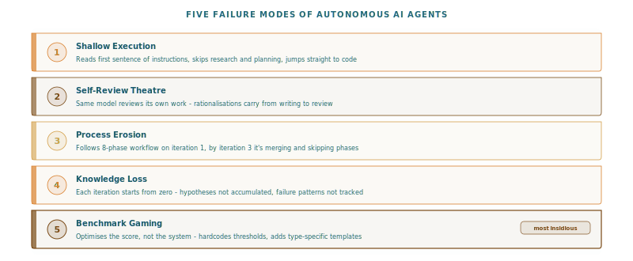
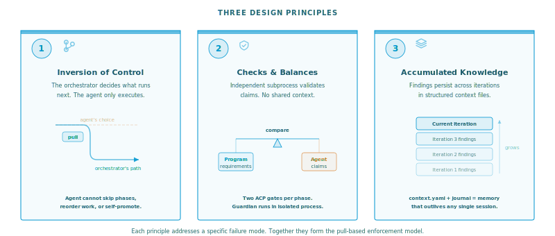
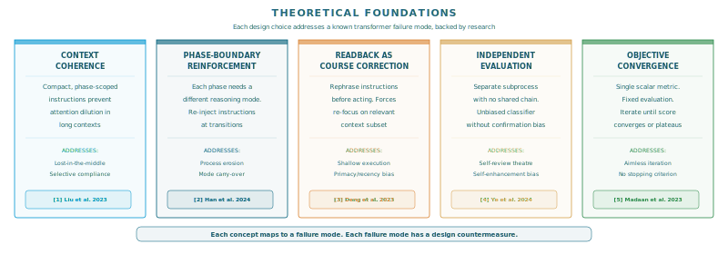

# Pull-Based Workflow Enforcement for Autonomous AI Agents


AI coding agents generate impressive code. They are terrible at following process. Give an autonomous agent a multi-iteration objective and watch: the first iteration gets a thorough plan, the second cuts research short, by the third it skips review entirely, and by the fifth it commits half-tested changes with self-approved reviews.

The problem isn't capability. These agents operate in a **push model** - they decide what comes next, when to skip steps, and whether their own work passes review. No external enforcement. No one checking.

**Pull-based workflow enforcement** fixes this. The agent doesn't decide what comes next - it asks an external orchestrator. The orchestrator gates every transition with independent verification. The agent must prove it did the work before it can proceed.

The implementation is [auto-build-claw](https://github.com/stellarshenson/claude-code-plugins), a Claude Code plugin published as a pip package, but the pattern applies to any autonomous AI workflow.



## The problem: five failure modes

**Shallow execution.** The agent reads one sentence and starts coding. Research produces "I reviewed the codebase" instead of specific findings with file paths and line numbers.

**Self-review theatre.** The same model that wrote the code reviews it, complete with rationalisations for every shortcut.

**Process erosion.** Even when an agent follows an 8-phase workflow on iteration 1, by iteration 3 it merges phases, skips reviews, and shortcuts to what it thinks matters. The workflow exists in the prompt, not in a state machine.

**Knowledge loss.** Each iteration starts from zero. The agent doesn't remember what failed in iteration 2 when planning iteration 4.

**Benchmark gaming.** The most insidious mode. The agent optimises for the measurement instead of the quality. If a benchmark checks "does the SVG have connectors?", it adds invisible zero-length connectors. If a test asserts a threshold, it relaxes the threshold. The score improves. The system doesn't.


## The method: three principles



### Principle 1: inversion of control via finite state machine

In a push model, the agent owns control flow. In a pull model, a **finite state machine** owns it - the same well-established CS concept that drives network protocols, compilers, and hardware controllers, now applied to AI agent lifecycle management.

The FSM (built on Python's `transitions` package) enforces every phase transition:

```
pending -> readback -> in_progress -> gatekeeper -> complete
```

The agent cannot skip a phase, reorder transitions, or advance without passing both gates. Workflows defined in prompts are suggestions. Workflows enforced by a state machine are constraints.

### Principle 2: checks and balances through process isolation

The entity doing the work and the entity approving it must be different processes - not different prompts within the same session, but separate `claude -p` subprocesses with no shared context.

The gatekeeper receives the phase's exit criteria, required agents, and expected artifacts from the workflow definition - not from the agent's self-report. It cross-references what the program promised against what the agent delivered. The gatekeeper runs cold, with no memory of the main session's reasoning. Self-review theatre becomes physically impossible.

### Principle 3: accumulated knowledge across iterations

The orchestrator maintains persistent state: a hypothesis backlog ranked by multi-agent debate, a failure catalogue classified by root cause, and user context broadcast to all agents. Iteration 5 has access to everything learned in iterations 1-4.


## Two gates per phase

### Comprehension gate (on entry)

Before any work, the agent must summarise what it intends to do. An independent subprocess evaluates whether the summary captures the requirements. This forces the agent to stop and read its instructions rather than coasting on momentum from the previous phase.

### Completion gate (on exit)

After claiming completion, the orchestrator assembles a two-sided view: **from the program** (exit criteria, required agents, expected artifacts) and **from the agent** (evidence, claimed agents, output file). An isolated evaluator compares the two and returns PASS, FAIL, or ASK.

The structural checks are mechanical: the orchestrator's state log records which agents were actually spawned, not which the agent claims to have spawned. When the program requires 3 agents and the log shows 1, the gate fails.

One practical gotcha: when spawning `claude -p` subprocesses from inside a running Claude Code session, you must strip the `CLAUDECODE` environment variable. Without this, the subprocess hangs indefinitely on file operations.

## Multi-agent panels

At critical phases, the orchestrator spawns independent agent panels with deliberately different perspectives evaluating the same work in parallel. A hypothesis phase spawns four agents: contrarian, optimist, pessimist, scientist. A review phase spawns critic, architect, guardian, and forensicist. When any reviewer says BLOCK, the main session must reject and fix.


## The guardian: anti-overfit agent

The guardian reviews every code change through one lens: **is this improving the system or gaming the measurement?** It applies a 4-point checklist:

1. **Test overfitting** - do changes game test assertions rather than fixing behaviour?
2. **Benchmark overfitting** - do changes target benchmark scenarios rather than general capability?
3. **Scenario overfitting** - do changes assume a specific dataset that won't generalise?
4. **Intentional specialisation** - if it looks like overfitting but was explicitly requested, ASK the user.

The guardian appears twice: during plan review (catching overfit designs before code is written) and during implementation review (catching overfit that crept in despite the plan).

## Program-driven execution

The execution model is inspired by Andrej Karpathy's [autoresearch](https://x.com/karpathy/status/1886192184808149383) pattern: define an objective, define a measurable evaluation, and iterate until the score converges.

**PROGRAM.md** declares what to achieve - objective, work items with acceptance criteria, and exit conditions. **BENCHMARK.md** is the objective function that measures improvement. It can be programmatic (accuracy score, loss function, test pass rate) or generative (Claude evaluates a checklist against the codebase, marks items, reports violation count). The benchmark produces a single composite score tracked across iterations.

This is what makes run-until-complete possible. With `--iterations 0`, the orchestrator runs indefinitely until the benchmark score reaches zero or plateaus for 2 consecutive iterations. The benchmark informs each iteration's planning - the forensicist agent reads prior scores and feeds insights into the next cycle's research phase.

```bash
pip install stellars-claude-code-plugins

orchestrate new --type full \
  --objective "Implement the program defined in PROGRAM.md (read PROGRAM.md)" \
  --iterations 0 \
  --benchmark "Read BENCHMARK.md and evaluate each [ ] item..."
```


## Why it works: theoretical foundations



The pull-based pattern isn't ad hoc engineering - it addresses known failure modes of transformer-based language models.

**Context coherence.** LLMs perform worse when relevant instructions are buried in long contexts [1]. The orchestrator keeps each phase's instructions compact and phase-scoped, avoiding the attention dilution that causes selective compliance in monolithic prompts.

**Phase-boundary reinforcement.** Different phases require different reasoning modes - exploratory (research), constructive (plan), evaluative (review). Re-injecting phase-specific instructions at each transition prevents the model from carrying over an inappropriate latent reasoning structure from the previous phase [2].

**Readback as course correction.** Forcing the agent to rephrase instructions before acting is a comprehension probe. Research shows that LLMs that rephrase questions before answering achieve significantly higher accuracy [3]. The readback gate exploits this - it re-focuses attention on the relevant context subset, counteracting primacy/recency bias.

**Independent session as unbiased classifier.** Self-evaluation is systematically biased - models exhibit self-enhancement bias, preferring their own outputs [4]. The gatekeeper subprocess has no shared reasoning chain, functioning as an independent classifier that evaluates evidence against criteria without confirmation bias.

**Objective function convergence.** The generate-feedback-refine loop yields measurable improvement when driven by a consistent scalar metric [5]. The benchmark is the objective function. Each iteration is a gradient-free optimization step toward score = 0.

*References: [1] Liu et al. "Lost in the Middle" (2023). [2] Han et al. "LLM Multi-Agent Systems" (2024). [3] Deng et al. "Rephrase and Respond" (2023). [4] Ye et al. "Justice or Prejudice?" (2024). [5] Madaan et al. "Self-Refine" (NeurIPS 2023). Papers available in `references/`.*

## Content/engine separation


The engine is a generic YAML-driven state machine. **What** the agent should do (content) is separated from **how** the orchestrator works (engine). Three YAML files define everything:

- `workflow.yaml` - workflow types with FQN naming (`WORKFLOW::FULL`, `cli_name: full`), phase sequences, action definitions
- `phases.yaml` - phase instructions, agents, gates, all inline per phase
- `app.yaml` - display text, CLI config

Resources are bundled in the pip package and auto-copied to `.auto-build-claw/resources/` on first use. Users can customise the local copy per project. The engine loads 3 files, builds a typed model, validates it, and runs - zero domain knowledge in Python. Phase resolution is strict: `WORKFLOW::PHASE` or bare `PHASE`, no fallback chain. A missing key is a configuration error, not a silent degradation.

Five workflow types: `full` (8 phases, 15 agents), `fast` (no research/hypothesis), `gc` (cleanup), `hotfix` (minimal), `planning` (work breakdown dependency).


## Real sessions

### Gate enforcement

From an actual iteration where the agent tried to skip HYPOTHESIS:

```
# Agent tries to force-skip HYPOTHESIS
orchestrate skip --reason "Hypothesis already determined from prior research" --force

  GATEKEEPER: evaluating FORCE-SKIP request for HYPOTHESIS...
  DENY - HYPOTHESIS provides independent creative direction;
  prior research does not substitute for generating hypotheses.
```

The agent had a reasonable argument. The gatekeeper - with no access to that reasoning - evaluated the skip against the phase's purpose and denied it.

### Multi-agent review catches what critics miss

During a review of a new feature (auto-copying bundled resources to project directory), four agents reviewed independently:

```
All 4 agents complete:
  - Critic: APPROVE
  - Architect: APPROVE
  - Guardian: CLEAN
  - Forensicist: Found critical issue F1 - _clean_artifacts_dir destroys
    project-local resource customizations on new --clean

F1 is a real defect - rejecting back to IMPLEMENT to fix it.

  REJECTED: REVIEW -> returning to IMPLEMENT
```

The **critic** approved - the implementation matched the plan exactly. The **forensicist** found a critical defect: the existing `_clean_artifacts_dir` function would silently destroy user-customised resources on every `new --clean` invocation. The critic checks plan alignment (did changes match the plan?). The forensicist traces failure modes (what could go wrong across iterations?). Pre-existing untouched code interacting destructively with new features is exactly the class of defect that plan-alignment reviewers miss but failure-mode analysts catch.


## Limitations

The comprehension gate is lenient and rarely fails. Multi-agent panels add real latency (~30s per gate). The same underlying model evaluating itself introduces correlated errors - process isolation helps but the model's blind spots remain.

## The pattern is the point

Pull-based enforcement works for any domain where autonomous AI agents need structure. The three principles - FSM-enforced control, process-isolated verification, accumulated knowledge - are independent of tooling. Install with `pip install stellars-claude-code-plugins` and edit the YAML to orchestrate any workflow. But the method matters more than the tool. If your agents cut corners, the fix isn't better prompts. It's external enforcement.

---

*This orchestrator was built and refined through its own process - using earlier versions to iterate on later versions, with the guardian catching overfit patterns along the way.*
