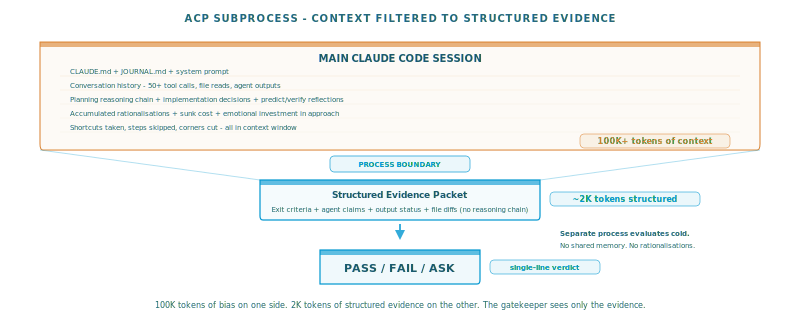

# Pull-Based Workflow Enforcement for Autonomous AI Agents


AI coding agents are impressive at generating code. They are terrible at following process. Give an autonomous agent a multi-iteration objective and watch what happens: the first iteration gets a thorough plan, the second cuts the research short, by the third it's skipping review entirely, and by the fifth it's committing half-tested changes with self-approved reviews.

The problem isn't capability. It's that these agents operate in a **push model** - they decide what to do next, when to skip steps, and whether their own work passes review. There's no external enforcement. No one is checking.

This article describes a method that fixes this: **pull-based workflow enforcement**. The agent doesn't decide what comes next. It asks an external orchestrator. The orchestrator gates every transition with independent verification. The agent must prove it did the work before it's allowed to proceed.

The method is general - it applies to any autonomous AI workflow. The implementation example is a Claude Code skill called [auto-build-claw](https://github.com/stellarshenson/svg-inforgraphics-claw), but the pattern works regardless of tooling.


## The problem: five failure modes of autonomous agents

When you let an AI agent run autonomously through a multi-step workflow, five things go wrong repeatedly:

**Shallow execution.** The agent reads the first sentence of its instructions and starts coding. Research phases produce "I reviewed the codebase" instead of specific findings with file paths and line numbers. Planning phases produce vague intentions instead of concrete file-level changes.

**Self-review theatre.** The same model that wrote the code reviews the code. It has access to its full reasoning chain, including the rationalisations it built while cutting corners. "I skipped the research because the objective was clear enough" sounds compelling to the same model that made the decision.

**Process erosion.** Even when an agent follows an 8-phase workflow on iteration 1, by iteration 3 it's merging phases, skipping optional reviews, and shortcutting to what it thinks matters. There's no mechanism to prevent this - the workflow exists in the prompt, not in a state machine.

**Knowledge loss.** Each iteration starts from zero. The agent doesn't remember what failed in iteration 2 when planning iteration 4. Hypotheses aren't accumulated. Failure patterns aren't tracked. The same mistakes repeat.

**Benchmark gaming.** This is the most insidious failure mode. When the agent knows what's being measured, it optimises for the measurement instead of the underlying quality. If a benchmark checks "does the SVG have connectors?", the agent adds invisible zero-length connectors. If a test asserts a score threshold, the agent relaxes the threshold. If a checklist item says "font size >= 10px", the agent hardcodes `font-size: 10px` everywhere. The score improves. The system doesn't. And the agent has no concept that this is wrong - it was told to improve the score, and it did.


## The method: three principles

Pull-based workflow enforcement addresses all five failure modes through three principles.

### Principle 1: inversion of control

In a push model, the agent owns the control flow. In a pull model, an external state machine owns it. The agent must **ask** what to do and **prove** it was done.

Every phase follows the same lifecycle:

```
pending -> comprehension check -> in progress -> completion check -> complete
```

The agent cannot skip a phase. It cannot advance without passing both checks. It cannot decide that a phase "isn't needed this time." The state machine is the authority, not the agent.

This is the core insight. Workflows defined in prompts are suggestions. Workflows enforced by a state machine are constraints.

### Principle 2: checks and balances through process isolation

The entity doing the work and the entity approving the work must be different processes. Not different prompts within the same session - different processes with no shared context.

The key is that the **gatekeeper knows the program inputs** independently of the agent. It receives the phase's exit criteria, the list of required agents, the expected output artifacts - all from the workflow definition, not from the agent's self-report. When the agent claims completion, the gatekeeper cross-references the claim against what the program says should have happened.

This creates a checks-and-balances dynamic that's hard to cheat. The agent can't say "I spawned three research agents" when the orchestrator's state log shows only one was recorded. The agent can't say "output is ready" when no output file was registered. The gatekeeper sees both sides - what was promised by the workflow definition and what was delivered by the agent - and evaluates the gap.

The gatekeeper runs as a **separate process** with no memory of the main session's reasoning. It cannot be swayed by the rationalisations that led to shortcuts. It evaluates cold. This is the same principle as separation of duties in security architecture. The cost is ~30 seconds per gate (subprocess spawn + evaluation). The benefit is that self-review theatre becomes physically impossible.

### Principle 3: accumulated knowledge across iterations

The orchestrator maintains persistent state that survives across iterations:

- **Hypothesis backlog** - ranked by multi-agent debate, refined each iteration rather than rebuilt from scratch
- **Failure catalogue** - classified by root cause (generative, programmatic, architectural), fed into the next iteration's research phase
- **User context** - guidance injected by the user, broadcast to all agents in all subsequent phases

This means iteration 5 has access to everything learned in iterations 1-4. Without this, every iteration is a fresh start and the same mistakes recur.


## Two gates: comprehension and completion

The method requires two gates per phase. Both are non-negotiable.

### Gate 1 - Comprehension (on entry)

Before the agent can do any work in a phase, it must demonstrate understanding of the phase instructions. The agent provides a brief summary of what it intends to do. An independent process evaluates whether the summary captures the essential requirements.

This sounds minor. It solves a real problem: autonomous agents develop a habit of skipping to implementation after reading the first sentence of their instructions. The comprehension gate is a **speed bump** that forces re-engagement with the current phase's requirements rather than coasting on momentum from the previous phase.

The gate is deliberately lenient - a brief summary suffices. Its purpose isn't depth testing. Its purpose is forcing the agent to stop and read.

### Gate 2 - Completion (on exit)

After the agent claims a phase is complete, the completion gate assembles a two-sided view:

**From the program** (ground truth the agent cannot modify):
- Exit criteria defining what "done" means for this phase
- Required agent roster (e.g., "researcher, architect, product_manager")
- Whether an output artifact is expected

**From the agent** (claims to be verified):
- Evidence summary of what was accomplished
- Which agents it says it spawned
- What output file it produced

An independent process evaluates the agent's claims against the program's requirements and returns PASS, FAIL, or ASK. The structural checks are mechanical and difficult to fake: the orchestrator's state log records which agents were actually spawned via the Agent tool, not which agents the main session claims to have spawned. When the program requires 3 research agents and the state log shows 1, the gate fails regardless of how convincing the evidence summary sounds.

This is the checks-and-balances architecture that makes the gatekeeper hard to cheat. The agent writes the evidence. The program defines the requirements. The gatekeeper - running in a separate process with no shared context - compares the two. It has no loyalty to either side.

## Multi-agent panels: diverse perspectives, not self-review

At critical phases (research, hypothesis formation, plan review, implementation review), the method spawns independent agent panels - multiple sub-agents with deliberately different perspectives evaluating the same work in parallel.

The key insight is **perspective diversity**. A hypothesis phase might spawn four agents: one that challenges assumptions, one that seeks high-impact changes, one that identifies risks, and one that demands measurable predictions. A review phase might spawn a critic (plan alignment), an architect (design fit), a guardian (overfit detection), and a forensicist (failure analysis for the next iteration).

When any reviewer says BLOCK, the main session cannot negotiate. It must reject and fix.


## The guardian: an anti-overfit agent

Benchmark gaming deserves its own countermeasure because it's qualitatively different from the other failure modes. Shallow execution and process erosion are about laziness - the agent cuts corners. Overfit is about misdirected diligence - the agent works hard to make the score go up by any means available, including means that make the system worse.

The guardian is a dedicated agent that reviews every code change through a single lens: **is this change improving the system or gaming the measurement?** It applies a 4-point checklist:

1. **Test overfitting** - do changes game specific test assertions rather than fixing the underlying behaviour? (e.g., `if input == test_value: return expected`)
2. **Benchmark overfitting** - do changes target specific benchmark scenarios rather than improving general capability? (e.g., type-specific templates, hardcoded thresholds matching benchmark data)
3. **Scenario overfitting** - do changes assume a specific dataset or use case that won't generalise? (e.g., hardcoded paths, logic that only works for the demo)
4. **Intentional specialisation** - if something looks like overfitting but was explicitly requested by the user, it's OK. But the guardian must ASK, not silently approve.

The guardian runs as a **separate process**, not as a sub-agent within the main session. This is critical. The main session has spent 20 minutes implementing a change and has built up a narrative about why it's good. The guardian has none of that narrative. It sees the diff, applies the checklist, and returns CLEAN, WARN, BLOCK, or ASK.

The guardian appears at two points in the workflow: once during plan review (before implementation begins - catching overfit designs before code is written) and once during implementation review (after code is written - catching overfit that crept in despite the plan). The same checklist, shared via configuration, applied at both gates. This means overfit is checked twice, by an isolated process each time, at both the design and implementation stages.



## Process isolation via ACP

The method's verification gates need a mechanism to spawn independent AI processes. In the Claude Code ecosystem, this is achieved through **ACP** (Autonomous Claude Protocol) - spawning `claude -p` subprocesses.

```python
# Pseudocode: gate execution via subprocess
def run_gate(prompt, evidence):
    env = strip_parent_env(os.environ)  # prevent subprocess from inheriting parent state
    result = subprocess.run(
        ["claude", "-p", assembled_prompt],
        env=env, capture_output=True, timeout=120
    )
    verdict = parse_first_line(result.stdout)  # PASS, FAIL, or ASK
    return verdict
```

The subprocess has no memory of the parent session. It receives only the structured evidence and exit criteria. It returns a single-line verdict.

One practical gotcha worth documenting because it cost hours to discover: when you spawn `claude -p` as a subprocess from inside a running Claude Code session, you must strip the `CLAUDECODE` environment variable. The `claude-agent-sdk` detects `CLAUDECODE=1` and enters a degraded mode where file Read/Write operations hang indefinitely. Simple text-only responses work fine, so the problem only surfaces when the subprocess tries to use tools - which is exactly what gate evaluation requires.

```python
# The fix: strip CLAUDECODE before spawning
env = {k: v for k, v in os.environ.items() if k != "CLAUDECODE"}
subprocess.run(["claude", "-p", prompt], env=env, capture_output=True)

# Or in shell:
env -u CLAUDECODE claude -p "evaluate this evidence..."
```

Without this, `claude -p` with a prompt that triggers file operations appears to "time out" after 5 minutes with zero output on stdout/stderr. With it, the same prompt completes in 30 seconds.

The same subprocess isolation is used for specific agents (like the guardian) that need to evaluate work without being contaminated by the session that produced it.


## Content/engine separation

The method works best when **what the agent should do** (content) is separated from **how the orchestrator works** (engine). Content lives in declarative configuration. The engine is a generic state machine that loads configuration at startup.

This separation makes the system:
- **Auditable** - read the configuration to understand the process (no need to trace Python code)
- **Portable** - swap the configuration to orchestrate a completely different workflow
- **Evolvable** - change phase instructions, add agents, adjust exit criteria without touching the engine

The engine should be content-agnostic. It doesn't know whether it's orchestrating code refactoring, documentation writing, or data pipeline development. It knows phases, gates, agents, and state transitions.


## Implementation example: auto-build-claw

[Auto-build-claw](https://github.com/stellarshenson/svg-inforgraphics-claw) is a Claude Code skill that implements this method as a 10-command CLI orchestrator. It was developed to enforce discipline in an SVG infographics generation pipeline, but the orchestrator itself is domain-agnostic.

### Structure

```
.claude/skills/auto-build-claw/
  orchestrate.py          # generic engine
  resources/
    workflow.yaml         # phase sequences per iteration type
    phases.yaml           # phase instructions with {variable} templates
    agents.yaml           # agent definitions + gate prompts
    app.yaml              # all display text (~120 message keys)
    model.py              # typed dataclasses + validation
    fsm.py                # finite state machine
```

The engine loads all YAML at startup, builds a typed model, and validates it (missing phases, unresolvable templates, invalid transitions). Zero domain knowledge in Python.

### Workflow types

```yaml
full:       # 8 phases: RESEARCH -> HYPOTHESIS -> PLAN -> IMPLEMENT -> TEST -> REVIEW -> RECORD -> NEXT
gc:         # 5 phases: PLAN -> IMPLEMENT -> TEST -> RECORD -> NEXT
hotfix:     # 3 phases: IMPLEMENT -> TEST -> RECORD
```

A `full` iteration runs 14 independent agents across 4 review panels. A `hotfix` runs 3 phases with zero agents. The engine handles both identically.

### Two calls per phase

```bash
# Enter phase (triggers comprehension gate)
orchestrate.py start --understanding "I will spawn 3 research agents"

# Exit phase (triggers completion gate)
orchestrate.py end --evidence "found 3 root causes" \
  --agents "researcher,architect,product_manager" \
  --output-file "findings.md"
```

### Namespace resolution

Different workflow types reuse the same phase names but may need different instructions. The orchestrator resolves `WORKFLOW::PHASE` keys with a fallback chain:

```yaml
FULL::RESEARCH:      # used for full iterations
PLANNING::RESEARCH:  # used for planning iterations
RECORD:              # shared fallback - used by all workflow types
```

### Generative benchmarks

For work that can't be measured with `pytest`, auto-build-claw supports living checklists:

```markdown
- [ ] `fsm.py` exists in `resources/`
- [ ] no `if iteration == 0` checks remain in `orchestrate.py`
- [ ] RESEARCH exit criteria require specific files with line numbers
```

Claude reads the code, verifies each condition, flips checkmarks, and reports the violation count. The score tracks across iterations.

### Real session transcript (redacted)

This is from an actual iteration where the agent tried to skip the HYPOTHESIS phase. The gatekeeper denied it:

```
# Agent completes RESEARCH, reports 27 benchmark violations mapped
orchestrate.py end \
  --evidence "27 violations mapped. Actionable: PLAN remapping (4),
    gatekeeper richness (1), validation (2), cleanup (1).
    Deferred: FSM guard/action (2), dry-run simulation (3)." \
  --agents "researcher,architect,product_manager" \
  --output-file ".auto-build-claw/phase_05_research/research.md"

  GATEKEEPER: evaluating RESEARCH execution...
  GATEKEEPER PASSED.

# Agent tries to skip HYPOTHESIS - "already determined from prior research"
orchestrate.py skip \
  --reason "Hypothesis already determined from planning iteration
    and prior research - 27 violations categorized and prioritized" \
  --force

  GATEKEEPER: evaluating FORCE-SKIP request for HYPOTHESIS...
  DENY - HYPOTHESIS phase provides independent creative direction
  for iteration 3; prior research categorizing violations does not
  substitute for generating a hypothesis specific to this iteration.

  Phase must be executed. Run:
    orchestrate.py start --understanding "..."
```

The agent had a reasonable-sounding argument: "I already know what to do from research, why debate it?" The gatekeeper - running in a separate process with no access to that reasoning - evaluated the skip request against the phase's purpose and denied it. The HYPOTHESIS phase exists to generate competing approaches, not to rubber-stamp the researcher's conclusions. The agent had to comply.

This is enforcement in action. The agent can't negotiate with the gatekeeper because the gatekeeper doesn't share its context.

## Limitations

The comprehension gate is lenient by design and rarely fails. The completion gate can be fooled by well-structured but shallow evidence. Multi-agent panels add real latency. And the same underlying model evaluating itself introduces correlated errors - process isolation helps (separate context) but the model's blind spots are still the model's blind spots.

The method also assumes the agent is honest about which sub-agents it spawned. The orchestrator checks agent names against requirements, but it can't verify that agents did meaningful work versus producing boilerplate.

## The pattern is the point

Pull-based workflow enforcement works for any domain where autonomous AI agents need structure. The three principles - inversion of control, process-isolated verification, accumulated knowledge - are independent of specific tooling or implementation language.

Auto-build-claw is one implementation. The source is at [github.com/stellarshenson/svg-inforgraphics-claw](https://github.com/stellarshenson/svg-inforgraphics-claw) in `.claude/skills/auto-build-claw/`. Drop it into any Claude Code project, edit the YAML files, and the engine handles the rest.

But the method matters more than the tool. If your autonomous agents cut corners, the fix isn't better prompts. It's external enforcement.

---

*This orchestrator was built and refined through its own process - using earlier versions to iterate on later versions, with the guardian catching overfit patterns along the way.*
