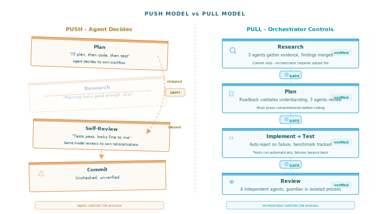
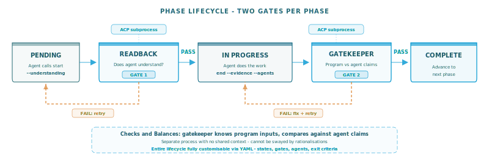
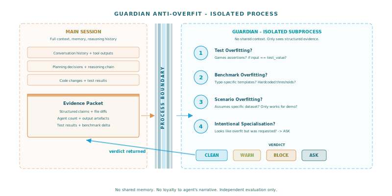
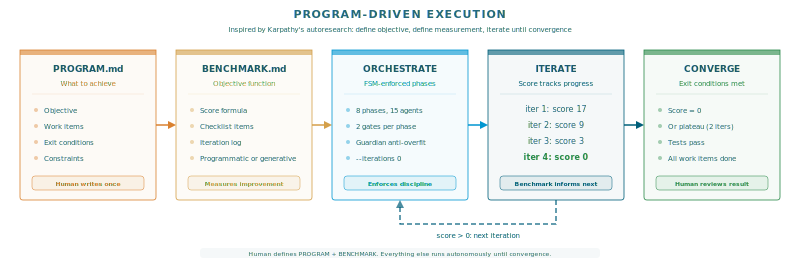
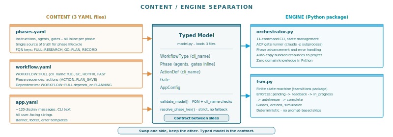
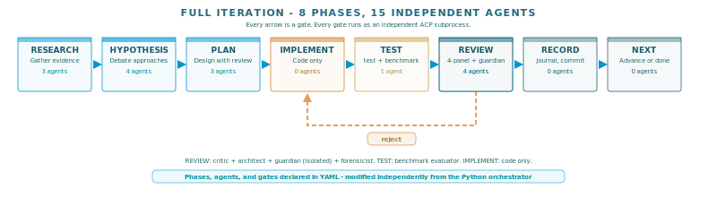
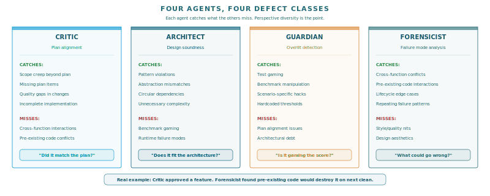

# Your AI Agent Will Cut Corners. Here's How to Stop It.


```
orchestrate skip --reason "Hypothesis already determined from prior research" --force

  GATEKEEPER: evaluating FORCE-SKIP request for HYPOTHESIS...
  DENY - HYPOTHESIS provides independent creative direction;
  prior research does not substitute for generating hypotheses.
```

This is iteration three. The agent had a reasonable argument - it already knew what to do from prior research, why debate it? A gatekeeper with no access to that reasoning evaluated the skip request against the phase's purpose and denied it. The agent had to comply.

By iteration five, without this constraint, it would be committing half-tested changes with self-approved reviews. Give an autonomous agent a multi-iteration objective and watch: the first iteration follows the process. The third cuts research. The fifth ships broken code.

The problem isn't capability. It's that agents operate in a **push model** - they decide what comes next, when to skip steps, and whether their own work passes review. No one is checking.

**Pull-based workflow enforcement** fixes this. The agent asks an orchestrator what to do. The orchestrator gates every transition with independent verification. The agent proves it did the work before it can proceed. The implementation is [autobuild](https://github.com/stellarshenson/claude-code-plugins), a Claude Code plugin, but the pattern applies to any autonomous AI workflow.

## Five failure modes

**Shallow execution.** The agent reads one sentence and starts coding. Research produces "I reviewed the codebase" instead of specific findings with file paths and line numbers.

**Self-review theatre.** The same model that wrote the code reviews it, complete with rationalisations for every shortcut.

**Process erosion.** Even when an agent follows an 8-phase workflow on iteration 1, by iteration 3 it merges phases, skips reviews, and shortcuts to what it thinks matters. The workflow exists in the prompt, not in a state machine.

**Knowledge loss.** Each iteration starts from zero. The agent doesn't remember what failed in iteration 2 when planning iteration 4.

**Benchmark gaming.** The most insidious mode. The agent optimises for the measurement instead of the quality. If a benchmark checks "does the SVG have connectors?", it adds invisible zero-length connectors. If a test asserts a threshold, it relaxes the threshold. The score improves. The system doesn't.



## The method: three principles

### Principle 1: inversion of control

In a push model, the agent owns control flow. In a pull model, a **finite state machine** owns it - the same well-established CS concept that drives network protocols and compilers, applied to AI agent lifecycle management. The FSM (Python's `transitions` package) enforces every phase transition. The agent cannot skip a phase, reorder transitions, or advance without passing both gates. Workflows defined in prompts are suggestions. Workflows enforced by a state machine are constraints.

### Principle 2: process isolation

The entity doing the work and the entity approving it must be different processes - separate `claude -p` subprocesses with no shared context. The gatekeeper receives exit criteria, required agents, and expected artifacts from the workflow definition, not from the agent's self-report. It cross-references what the program promised against what the agent delivered. Self-review theatre becomes physically impossible.

### Principle 3: accumulated knowledge

The orchestrator maintains persistent state across iterations: a hypothesis backlog ranked by multi-agent debate, a failure catalogue classified by root cause, and user context broadcast to all agents. Iteration 5 has access to everything learned in iterations 1-4.



## Two gates per phase

Every phase follows the same lifecycle, enforced by the FSM:

```
pending -> readback -> in_progress -> gatekeeper -> complete
```

**Comprehension gate (on entry).** Before any work, the agent summarises what it intends to do. The gatekeeper evaluates whether the summary captures the requirements. This forces the agent to stop and re-read its phase instructions rather than coasting on momentum.

**Completion gate (on exit).** The orchestrator assembles a two-sided view: **from the program** (exit criteria, required agents, expected artifacts) and **from the agent** (evidence, claimed agents, output file). The gatekeeper compares the two and returns PASS, FAIL, or ASK. The structural checks are mechanical: the state log records which agents were actually spawned, not which the agent claims. When the program requires 3 agents and the log shows 1, the gate fails.

One practical gotcha: when spawning `claude -p` from inside a running Claude Code session, strip the `CLAUDECODE` environment variable. Without this, the subprocess hangs indefinitely on file operations.

## Multi-agent panels

At critical phases, the orchestrator spawns independent agent panels with deliberately different perspectives: contrarian, optimist, pessimist, scientist for hypothesis formation; critic, architect, guardian, forensicist for implementation review. When any reviewer says BLOCK, the main session must reject and fix.



## The guardian: anti-overfit agent

The guardian reviews every code change through one lens: **is this improving the system or gaming the measurement?** It applies a 4-point checklist:

1. **Test overfitting** - do changes game test assertions rather than fixing behaviour?
2. **Benchmark overfitting** - do changes target benchmark scenarios rather than general capability?
3. **Scenario overfitting** - do changes assume a specific dataset that won't generalise?
4. **Intentional specialisation** - if it looks like overfitting but was explicitly requested, ASK the user.

The guardian appears twice: during plan review (catching overfit designs before code is written) and during implementation review (catching overfit that crept in despite the plan).

## Why it works: theoretical foundations

These design choices address known transformer failure modes: LLMs lose relevant information buried in long contexts [1], so the orchestrator keeps instructions compact and phase-scoped. Different phases require different reasoning modes - exploratory, constructive, evaluative - and re-injecting instructions at transitions prevents mode carry-over [2]. Forcing the agent to rephrase instructions before acting is a comprehension probe that improves task accuracy [3]. The gatekeeper subprocess functions as an independent classifier without confirmation bias from the generating session [4]. And the generate-feedback-refine loop yields measurable improvement when driven by a consistent scalar metric [5] - the benchmark is the objective function, each iteration a gradient-free optimization step.

*[1] Liu et al. "Lost in the Middle" (2023). [2] Han et al. "LLM Multi-Agent Systems" (2024). [3] Deng et al. "Rephrase and Respond" (2023). [4] Ye et al. "Justice or Prejudice?" (2024). [5] Madaan et al. "Self-Refine" (NeurIPS 2023).*

## Program-driven execution

The execution model is inspired by Andrej Karpathy's [autoresearch](https://x.com/karpathy/status/1886192184808149383): define an objective, define a measurable evaluation, iterate until the score converges.

**PROGRAM.md** declares what to achieve - objective, work items with acceptance criteria, exit conditions. **BENCHMARK.md** is the objective function. It can be programmatic (accuracy score, loss function) or generative (Claude evaluates a checklist against the codebase, marks items, reports violation count). The benchmark produces a single composite score tracked across iterations. With `--iterations 0`, the orchestrator runs until the score reaches zero or plateaus for 2 consecutive iterations. The benchmark informs each iteration's planning - the forensicist reads prior scores and feeds insights into the next cycle.

```bash
/install-plugin stellarshenson/claude-code-plugins

orchestrate new --type full \
  --objective "Implement the program defined in PROGRAM.md (read PROGRAM.md)" \
  --iterations 0 \
  --benchmark "Read BENCHMARK.md and evaluate each [ ] item..."
```



## Content/engine separation

What the agent does and how the orchestrator works are completely separate. Three YAML files define phases, agents, gates, and workflow sequences. The engine loads them, builds a typed model, validates it, and runs. Change the YAML, change the process. The Python never changes. Install the plugin (`/install-plugin stellarshenson/claude-code-plugins`) and the resources auto-copy to your project for customisation.



The full workflow runs 15 independent agents across 8 phases. Shorter workflows (`gc`, `hotfix`, `fast`) use subsets of the same phases - the engine handles all identically.



## Real sessions

The skip-denial transcript at the top of this article is real. Here is another, from a different failure class:

### Multi-agent review catches what critics miss

During a review of a new feature (auto-copying bundled resources to project directory), four agents reviewed independently:

```
All 4 agents complete:
  - Critic: APPROVE
  - Architect: APPROVE
  - Guardian: CLEAN
  - Forensicist: Found critical issue F1 - _clean_artifacts_dir destroys
    project-local resource customizations on new --clean

F1 is a real defect - rejecting back to IMPLEMENT to fix it.

  REJECTED: REVIEW -> returning to IMPLEMENT
```

The **critic** approved - the implementation matched the plan. The **forensicist** found a critical defect: a pre-existing function would silently destroy user-customised resources on every `new --clean`. The critic checks plan alignment. The forensicist traces failure modes across iterations. Pre-existing code interacting destructively with new features is the class of defect that plan-alignment reviewers miss but failure-mode analysts catch.



## Limitations

The comprehension gate is lenient and rarely fails. Multi-agent panels add real latency (~30s per gate). The same underlying model evaluating itself introduces correlated errors - subprocess separation reduces but does not eliminate this. The method catches process failures, not capability failures. If the model cannot solve a problem, enforcing structure around it will not help. But most autonomous agent failures are process failures, not capability failures.

---

Agents do not need better prompts. They need constraints they cannot override.

---

*This orchestrator was built and refined through its own process - using earlier versions to iterate on later versions, with the guardian catching overfit patterns along the way.*
