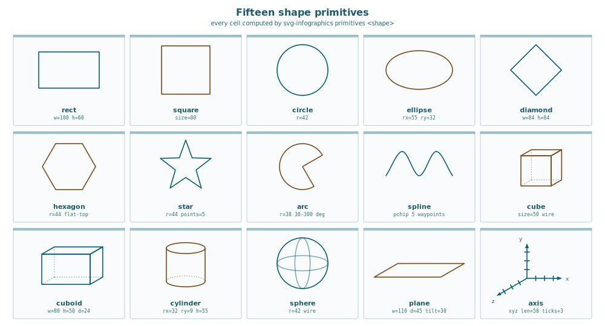
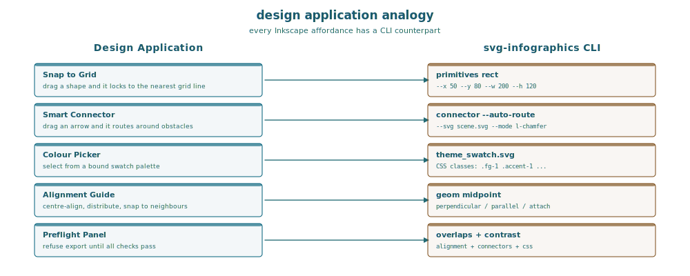
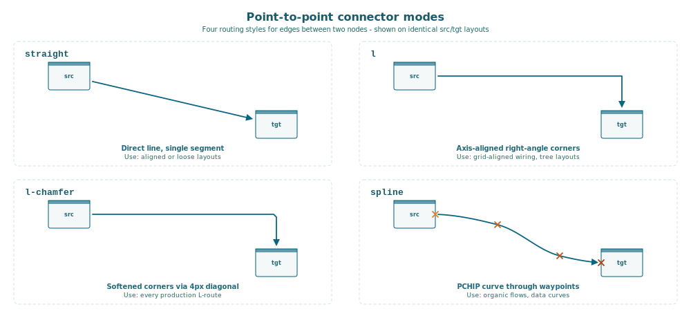
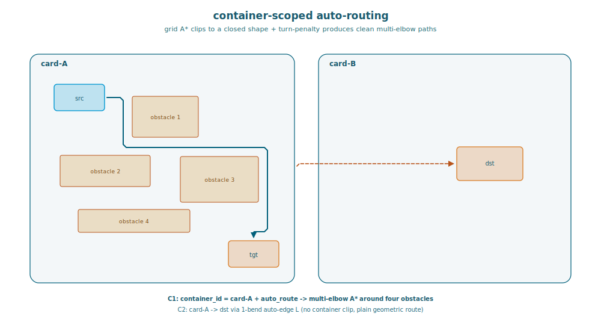
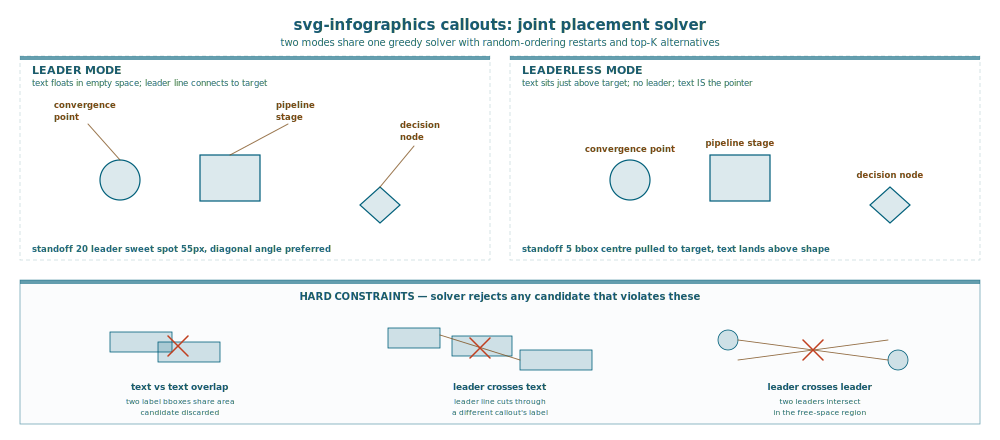
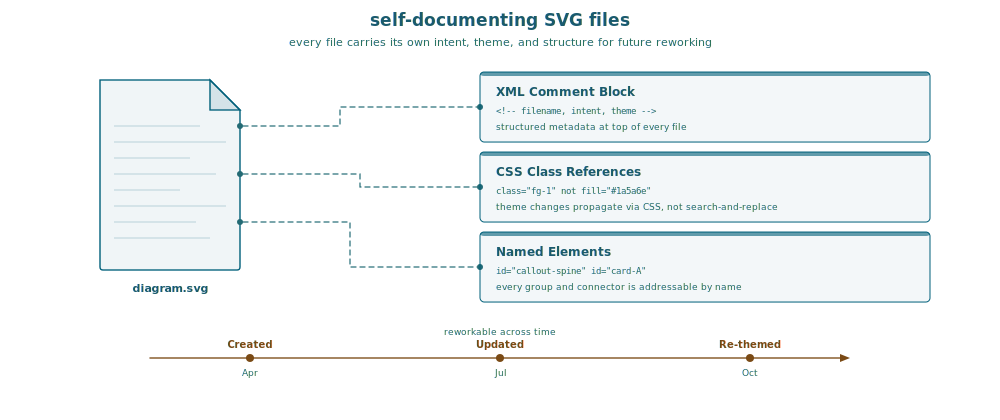
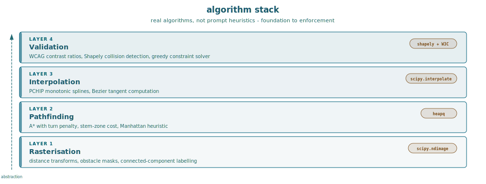
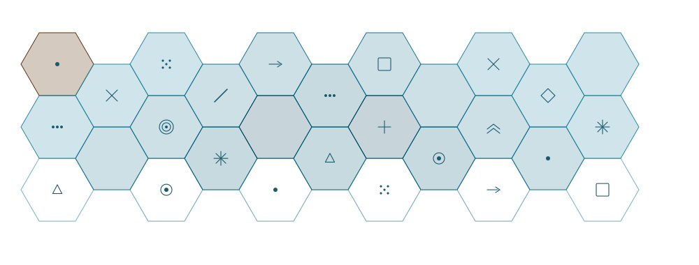
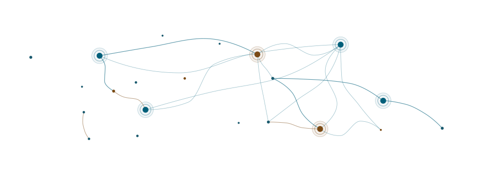

# Stop Fixing Your AI's SVGs


*A plugin that turns coordinate guessing into computed design - grid-first infographics with routing, alignment, and validation baked in.*

---

## The wrong abstraction

When you ask an LLM to "draw an SVG infographic", you are asking it to be an SVG *coder*. The model opens an invisible text editor and starts typing XML: `<rect x="50" y="80" width="200" height="120"/>`, then a `<text>` element with a guessed y-offset, then a `<line>` with hand-picked endpoints. Every coordinate is a token prediction. Nothing snaps to anything. There is no grid, no alignment guide, no ruler. The model is drawing blind.

A human designer would never work this way. Open any vector design application and you get snapping, smart connectors, alignment guides, a grid overlay, a colour picker bound to a swatch, and a layer panel. You do not type coordinates - you place shapes and the application computes the geometry. The design tool is the difference between a designer and someone writing PostScript by hand.

**The svg-infographics plugin is that design tool - built for AI agents.** It gives the LLM the same affordances a human gets from a design application: snap-to-grid placement, computed connectors that route around obstacles, alignment enforcement, theme-bound colours, and a validation panel that refuses broken output. The agent becomes the *designer* - deciding what to show, where cards go, which elements connect - while the tool handles the geometry, the colours, and the quality gate.

The result, across sixty-four production examples, is SVG that ships on the first pass. No hand-editing. No coordinate chasing. No 30-minute correction loops.


## What a designer gets that an LLM does not

Every vector graphics application provides five things that make design possible. Without them, you are coding pixels:

**Snap-to-grid.** A designer drags a card and it locks to the nearest grid line. An LLM typing `x="147"` has no grid. The offset drifts element by element, and by the tenth card the rhythm is gone. Fix time: 5-15 minutes per image.

**Smart connectors.** In a design app, you drag an arrow from card A to card B and the application routes it, adds the arrowhead, and adjusts when you move a card. An LLM guesses two endpoints, gets the arrowhead angle wrong, and produces a line that ends three pixels short of its target. Fix time: 5-10 minutes per arrow.

**Colour swatches.** A designer picks from a palette. An LLM types `fill="#000000"` because it is a cheap token. The colour disappears in dark mode, and now you need a full `<style>` block with `@media (prefers-color-scheme: dark)` overrides. Fix time: 10-20 minutes.

**Alignment guides.** Drag three cards and they centre-align automatically. An LLM types three independent `x` values and they are never quite equal. Fix time: 5-10 minutes for each alignment pass.

**A quality gate.** A design app shows you the result live. An LLM ships XML and hopes for the best. You open the SVG, see the problems, go back to the model, ask for fixes, get new problems. Fix time: the entire correction loop - 30 to 90 minutes per image.

For a six-image article, that is **3-6 hours of hand-editing** that adds no creative value. The plugin replaces it with a single supervised pass through a structured workflow.


## The application: twelve tools in a CLI

The plugin ships as `stellars-claude-code-plugins`, exposing a unified `svg-infographics` CLI. The agent calls these tools the same way a designer clicks toolbar buttons - except through function calls instead of mouse clicks.

**Design tools (the agent's "drawing canvas"):**

| Tool | Design app equivalent |
|------|-------------------|
| `primitives` | Shape palette - rect, circle, hexagon, star, arc, cube, cylinder, sphere, plus PCHIP spline curves. Returns exact anchors and paste-ready snippets |
| `connector` | Smart connector - five routing modes with snap-to-edge, auto-routing around obstacles, arrowhead computation |
| `geom` | Alignment guides and constraints - midpoint, perpendicular, tangent, intersection, parallel, polar, attachment points, containment |
| `callouts` | Auto-placement - joint label positioning via solver with overlap avoidance |
| `empty-space` | Free-region detection - "where can I put this without overlapping anything?" |
| `charts` | Chart panel - bar, line, area, radar, pie via pygal with theme-matched palettes |

**Quality panel (the agent's "preflight check"):**

| Tool | What it catches |
|------|-----------------|
| `overlaps` | Text/shape overlap, spacing rhythm, font-size floors, callout collisions |
| `contrast` | WCAG 2.1 for text AND objects in both light and dark mode |
| `alignment` | Grid snapping, vertical rhythm, layout topology |
| `connectors` | Dead ends, missing chamfers, edge-snap violations |
| `css` | Inline fills, missing dark-mode overrides, forbidden colours |
| `collide` | Pairwise connector intersection with near-miss detection |

The agent never types a coordinate. It calls `primitives rect --x 50 --y 80 --w 200 --h 120` and gets the rect plus its named anchors (top-center, right-mid, bottom-left, etc). Fourteen shape types are computed this way - from basic rectangles to isometric cubes and PCHIP spline curves:



It calls `connector --mode l-chamfer --src-rect ... --tgt-rect ... --start-dir E --end-dir S` and gets a fully routed path with arrowhead polygons in world coordinates. The tool does the maths. The agent does the design.




## The workflow: six phases, no shortcuts

A human designer works in phases - sketch, structure, content, polish, review. The plugin enforces the same discipline:

**Phase 1 - Research.** Study existing examples before drawing. **Phase 2 - Grid.** Define the invisible grid (viewbox, margins, column origins, rhythm) as comments before any visible element. **Phase 3 - Scaffold.** Place structural elements at computed positions. **Phase 4 - Content.** Add text and icons using CSS classes, never inline fills. **Phase 5 - Finishing.** Verify arrow placements, place callout labels. **Phase 6 - Validation.** Run all six checkers. No run, no delivery.

The key is Phase 2. The grid exists *before* anything is drawn. Every subsequent position is calculated from it. This is exactly how a designer works - you set up the artboard first, then design on it.


## Smart connectors that route around obstacles

In a desktop design application, you drag a connector between two shapes and it routes around everything in between. The plugin gives the agent the same capability.

The `connector` tool has five routing modes - from simple to complex:

- **straight** - single line, auto-snaps to nearest rect/polygon edge
- **l** - axis-aligned right-angle bend
- **l-chamfer** - softened corners with optional auto-routing
- **spline** - smooth PCHIP curves through waypoints (no overshoot, unlike hand-authored beziers)
- **manifold** - Sankey-style bundle with merge/fork topology



The auto-routing mode is where the "design application for agents" metaphor becomes concrete. Pass `--auto-route --svg scene.svg` and the tool reads the entire SVG, rasterises every shape as an obstacle, runs **grid A*** with turn penalty to find a multi-elbow path that avoids collisions, and returns a chamfered connector with clean stems behind the arrowhead. Container-scoped routing (`--container-id card-A`) clips the route to a specific shape's interior - exactly like a "route within group" feature in a desktop design tool.

**Straight-line collapse**: when src and tgt are nearly aligned, both endpoints slide along their edges to a shared coordinate and the L degenerates to a straight segment. The smaller geometry stays put; the larger absorbs the slide. The agent never has to think about this - the tool handles it.

```bash
svg-infographics connector --mode l-chamfer \
  --src-rect "90,140,84,44" --start-dir E \
  --tgt-rect "380,400,84,44" --end-dir S \
  --auto-route --svg scene.svg --container-id card-A \
  --chamfer 5 --standoff 4 --arrow end
```



## Auto-placement: callouts that do not overlap

In a design app, you drag a label near its target and the application nudges it away from overlapping elements. The plugin's callout solver does the same - but for ALL labels simultaneously.

Write a JSON plan listing every callout. The solver places them all at once using greedy search with five random restarts, enforcing hard constraints on text-text overlap, leader-text crossing, and leader-leader crossing.

**Leader mode** - text connected to target by a line (20 px standoff, scored on length and angle). **Leaderless mode** - text placed directly near the target (5 px standoff, scored on centre distance so symmetric labels settle centred). The agent picks the mode; the solver picks the position.



## The Sankey case: seven connectors in one call

Four sources into a pipeline spine, out to three sinks. In raw SVG that is seven separate connector calculations. The **manifold mode** takes the entire topology at once - starts, ends, spine endpoints, and a tension parameter that controls fan-out stiffness:

```bash
svg-infographics connector --mode manifold \
  --starts "[(50,100),(50,200),(50,300),(50,400)]" \
  --ends   "[(800,150),(800,300),(800,450)]" \
  --spine-start "(400,250)" --spine-end "(600,250)" \
  --shape spline --tension "(0.4, 0.7)" --arrow end
```

The tool infers everything: junction positions, strand trajectories, organic relaxation to avoid overlap, arrowhead placement. One call, seven strands, zero manual coordinates.


## Charts with automatic palette enforcement

The `charts` subcommand wraps pygal for clean, CSS-themeable SVG charts. The caller passes `--colors` and `--colors-dark` from the approved swatch; the tool injects a `@media (prefers-color-scheme: dark)` block and runs a **WCAG contrast audit** on every series against its background. Light-mode colours must be dark enough for `#ffffff`; dark-mode colours must be bright enough for `#0b0b0b`. Anything below 7:1 contrast gets flagged.


## Fail-first validation

The quality panel's key discipline: every finding is a real defect until the author individually classifies it as **Fixed**, **Accepted** (intentional violation), or **Checker limitation** (tool cannot resolve). No bulk dismissals. The default is fix.

This matters because LLMs, given the choice, dismiss every warning. The fail-first rule inverts the default: the checker is right unless the author names which of three exceptions applies. Exactly like a preflight panel refusing to export a PDF with missing fonts - the tool protects the designer from shipping broken work.


## Theme swatches: the palette picker

Before any deliverable, a `theme_swatch.svg` must exist and be approved - all colours labelled with CSS class names, rendered in both modes. This is the agent's colour picker, locked to the brand. If the palette is wrong, it is wrong before ten SVGs are built.


## Your colours, your styles - enforced everywhere

When an LLM generates SVG without constraints, it reaches for generic colours - `#000000`, `#333333`, the same teal-and-grey that every chatbot produces. The result looks like AI output because it IS generic AI output.

The plugin enforces YOUR brand. The theme swatch is an approval gate: you define the palette, approve it visually, and then every element in every SVG references your CSS classes. No element ever carries an inline fill. No colour exists that is not in the swatch. When your brand updates, you change the swatch and every diagram inherits the new palette through CSS. This is not prompt engineering - it is a design system.

## SVG files that remember their own intent

A PNG is a flat bitmap. An SVG generated by a raw LLM is better - it is structured XML - but the structure carries no context. Six months later, you open the file and see a wall of `<rect>` elements with no indication of what each card represents or why the layout was chosen.

The plugin's SVGs carry their own documentation. Every file starts with a structured XML comment block: filename, what it shows, the design intent, which theme it uses. Every element references a named CSS class. Every callout group has a `callout-*` id prefix. Every connector has an id linking it to its source and target.

This means the graphics are **reworkable long after creation**. An agent - or a human - can open the SVG months later, read the comment block, understand the intent, and update the content without reverse-engineering the layout. The file is its own specification. That is the difference between a graphic and a graphic asset.



## Built on algorithms, not heuristics

The plugin does not use prompt tricks. Every capability is backed by a real algorithm:

- **A\* pathfinding** with Manhattan heuristic and turn penalty for multi-elbow connector routing around obstacles
- **Euclidean distance transforms** (scipy `distance_transform_edt`) for free-region detection with erosion margins
- **PCHIP monotonic interpolation** for curves through waypoints that never overshoot - the same algorithm MATLAB uses for shape-preserving splines
- **WCAG 2.1 contrast ratios** computed from relative luminance per the W3C formula, not eyeballed
- **Greedy constraint satisfaction** with random restarts for joint callout placement - hard constraints on overlap, soft scoring on distance and angle
- **Connected-component labelling** on binary obstacle masks for free-island detection
- **Shapely geometric operations** for pairwise connector collision detection with tolerance buffers

These are the same algorithms that power design application snapping engines, auto-layout systems, and professional EDA routers. The plugin brings them to the agent's toolkit as CLI calls.



## Limitations

The plugin does not make an LLM creative. It enforces discipline - grid-first, CSS-clean, validator-approved - but it does not invent novel layouts. It gives the agent the tools of a designer, not the eye of one.

Dark mode via `prefers-color-scheme` does not work via `` tags or markdown `` - a browser constraint, not a plugin one.

The workflow adds latency. Building through six phases with tool calls takes longer than "write me an SVG". The return is that the output ships on the first pass - no 3-6 hour correction loop across a set of images.

## Creative output: beyond card grids

The plugin is not limited to card grids. The same computed geometry + CSS constraint pipeline produces organic layouts - hexagonal tessellations where every cell is precisely placed via `primitives hexagon` with polar coordinate spacing, and freeform constellation maps where spline connectors thread between radial node clusters with varying stroke weight and opacity. These are not hand-positioned - every coordinate traces back to a tool call.





## The pattern: tools, not tokens

The insight behind this plugin is not SVG-specific. When you need an LLM to produce a structured visual output - a diagram, a chart, a layout - do not ask it to code the output format. Give it a **design application** and let it be the designer. The application handles coordinates, constraints, and quality. The model handles intent.

Install with `pip install stellars-claude-code-plugins`, invoke `/svg-infographics:create`, and let the agent use the tool.

---

*Every infographic in this article was produced by the plugin itself - the agent as designer, the tool as application.*
