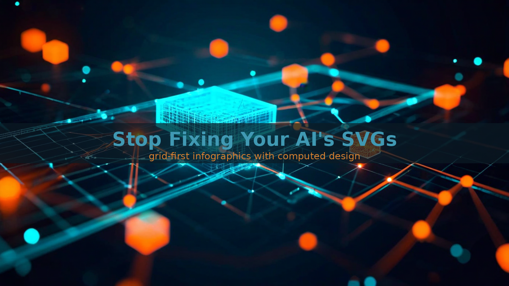
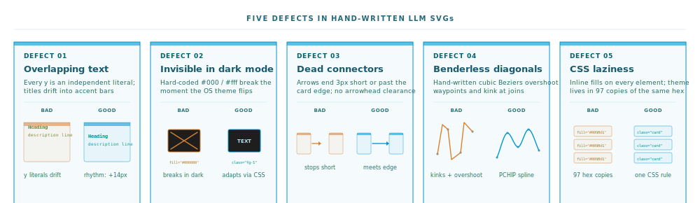
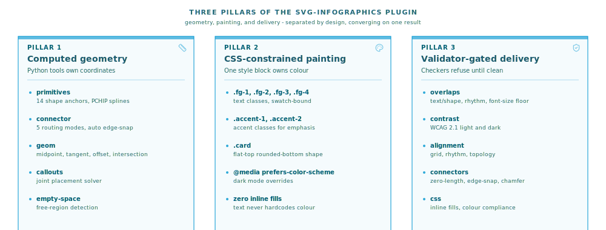
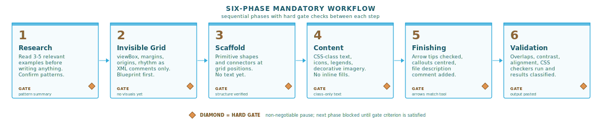
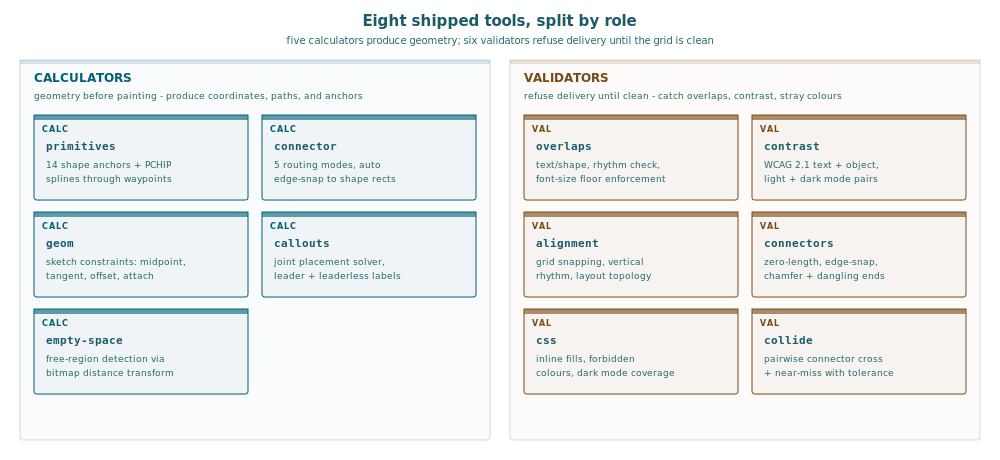
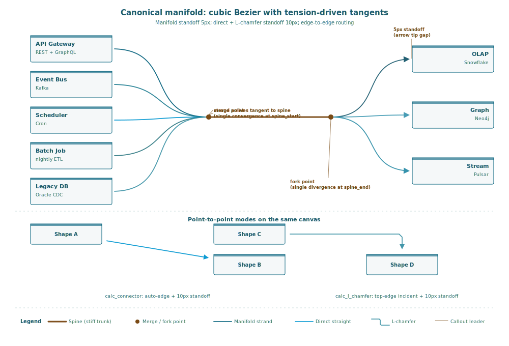
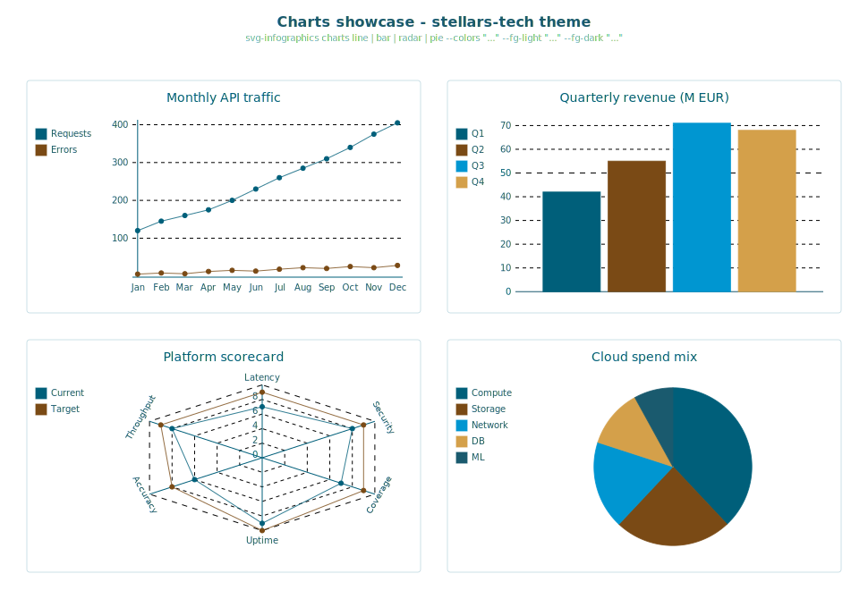
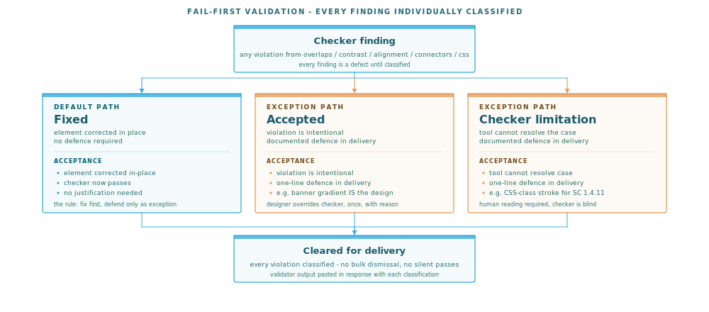
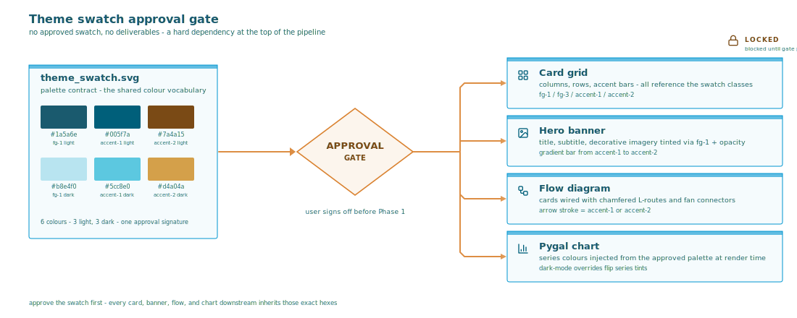

# Grid-First SVG Infographics for LLMs



*A plugin that refuses to deliver SVGs until every coordinate, colour, and connector is verified.*

Ask any frontier LLM to produce an SVG infographic. The response arrives in seconds: a block of `<rect>` and `<text>` elements, card-shaped things, arrows between them. Open it in a browser and the cracks show immediately. Text sits a pixel below its card. Arrows end nowhere. One colour breaks dark mode. A label overlaps its own icon. The geometry was guessed.

This is not a prompting problem. It is a **representation** problem. LLMs generate SVG the same way they generate prose: token by token, left to right, without an external model of the plane they are drawing on. They have no callipers. Every coordinate is an educated guess, and the guess compounds across a hundred elements.

The **svg-infographics** Claude Code plugin fixes this by inverting the approach. Instead of asking the model to emit pixels, it forces the model through a **grid-first workflow** where every coordinate is computed by a Python tool and every deliverable is refused by a validator until it passes. The result, on this repository's own marketplace banners and on sixty-four production examples, is SVG that is actually ready to ship.



## The problem: LLMs cannot draw by hand

A naive "write me an SVG card grid" session produces five recurring classes of defect.

**Overlapping text.** The model picks a card origin, picks a title offset, picks a description offset, and by the time three elements are stacked the title has drifted into the accent bar. There is no rhythm enforcement because there is no rhythm - every `y` is an independent literal.

**Invisible content in dark mode.** The model reaches for `#000000` or `#ffffff` because they are cheap tokens. Both disappear the moment the viewer's OS theme flips. The fix is a `<style>` block with `@media (prefers-color-scheme: dark)` overrides, but asking the model to maintain two palettes consistently without a ruleset is a losing battle.

**Dead connectors.** The arrow starts at card A and ends near card B. "Near" means three pixels short, or three pixels past, or exactly on the card edge without arrowhead clearance. Viewers see a line that does not visually terminate.

**Benderless diagonals.** Curves between waypoints come out as hand-written cubic beziers. The control points are guessed, the curve overshoots, and the join kinks at the waypoint. Every designer recognises the shape. Every LLM produces it.

**CSS laziness.** Colours end up as inline `fill="#hex"` on every element, which means the theme is not a theme at all - it is ninety-seven copies of the same hex code. When the palette changes, everything has to be rewritten by hand.

These are not prompt-engineering problems. They are consequences of asking a language model to produce a geometric artefact without a geometric substrate.

## The insight: separate geometry from painting

The plugin's core move is to split the problem in two.

**Geometry is computed by Python tools.** Card positions, circle centres, line endpoints, connector paths, curve interpolations, isometric cube vertices. None of it is written by the model. The model calls a tool, gets exact coordinates and a paste-ready SVG snippet, and places it.

**Painting is constrained by a CSS ruleset.** Colours live in a `<style>` block that traces back to an approved `theme_swatch.svg`. Elements reference classes, not hex values. A dark-mode media query defines the overrides in one place. The model never types a raw colour.

**Delivery is gated by validators.** Five Python checkers (`overlaps`, `contrast`, `alignment`, `connectors`, `css`) run before any SVG is considered done. Their output is the exit criterion. Failures are classified individually - no bulk dismissals - and the classification is part of the deliverable.

This is the same pull-based enforcement pattern that works for autonomous coding agents. The model does not get to self-certify. It computes, it paints within CSS, it submits, and an external process decides whether the work is acceptable.



## The 6-phase workflow

Each image, start to finish, follows six sequential phases. No batching across images, no shortcut from research to content.

**Phase 1 - Research.** Read three to five existing examples from the `examples/` directory closest to the image type being built. Card grid, flow diagram, timeline, stats banner, hub-and-spoke, layered model: the plugin ships with sixty-four production references. Before writing a single element, the author internalises the conventions the examples have already normalised.

**Phase 2 - Invisible grid.** Write the grid as an XML comment *before* any visible element exists in the file. ViewBox, margins, column origins, vertical rhythm, every card x/y, every arrow path. The grid is calculated by `svg-infographics primitives` - a tool that returns exact anchor coordinates for rects, circles, hexagons, stars, arcs, isometric cubes and cylinders, and PCHIP-interpolated splines. The SVG file at this phase contains zero rendered content. The gate is literal: the file has only comments, or the phase is not complete.

**Phase 3 - Scaffold.** Structural elements at the computed grid positions. Card outlines with flat tops and rounded bottoms. Accent bars above the cards. Arrows and connectors using `svg-infographics connector` in one of four modes (`straight`, `l`, `l-chamfer`, `spline`) - the tool returns the trimmed path with arrowhead clearance baked in plus the arrowhead polygon in world coordinates. No text, no icons, no content yet.

**Phase 4 - Content.** Titles, descriptions, legends, icons, decorative imagery. Every text element references a CSS class - `fg-1`, `fg-2`, `accent-1` - never an inline fill. Titles sit at accent-bar-bottom plus 12px, descriptions at 14px rhythm steps, font-size floor at 7px. Icons come from Lucide with an ISC licence comment. Opacity is forbidden on text (fonts render at full opacity always, contrast via colour).

**Phase 5 - Finishing.** Verify arrow placements against the connector tool. Place callout labels centred in gaps with 8px clearance. Write a file description comment before the `<svg>` tag: filename, what it shows, intent, theme.

**Phase 6 - Validation.** Run the checkers. Paste the output into the delivery. If the checkers were not run, the phase is not complete - this is a literal gate, not an aspiration.



## Eight tools, three calculators and five validators

The plugin ships as part of the `stellars-claude-code-plugins` pip package, exposing a unified `svg-infographics` CLI.

**Calculators (geometry before painting):**

| Tool | What it gives you |
|------|-------------------|
| `primitives` | Geometry plus named anchors for fourteen shapes: rect, square, circle, ellipse, diamond, hexagon, star, arc, cube, cuboid, cylinder, sphere, plane, axis. PCHIP splines through any set of control points |
| `connector` | Connector geometry in four modes: straight, L, L-chamfered, spline. Returns trimmed path, world-space arrowhead polygons, tangent angle at each end |
| `geom` | Sketch constraints in the Fusion-360 style: midpoint, perpendicular foot, line extension, tangent points, intersections, parallel/perpendicular construction, polar layouts, attachment points on rect/circle edges, parallel offsets for halos and label standoff |

**Validators (refuse delivery until clean):**

| Tool | What it catches |
|------|-----------------|
| `overlaps` | Text/shape overlap, spacing rhythm violations, font-size floors |
| `contrast` | WCAG 2.1 contrast for text AND objects-vs-background (light + dark mode) |
| `alignment` | Grid snapping, vertical rhythm, layout topology |
| `connectors` | Zero-length connectors, edge-snap, missing chamfers, dangling endpoints |
| `css` | Inline fills on text, missing dark-mode overrides, forbidden colours |

The PCHIP spline rule is worth singling out. Any curve through known waypoints - a decision boundary, a sigmoid, a score trajectory, an organic flow path - is built by running `primitives spline --points "x1,y1 x2,y2 ..."` and pasting the returned path verbatim. Hand-authored cubic beziers are forbidden for data curves because they overshoot and kink. The PCHIP interpolator is monotonicity-preserving and produces the exact curve a designer would draw.



## One call, seven strands: the manifold mode

Point-to-point connectors are the easy case. The hard case is an ingest pipeline that fans four sources into a shared spine and fans back out to three downstream sinks. Building that by hand is seven separate connector calls, plus the maths to choose where the trunk sits, plus the iteration to avoid overlap with the cards, plus the arrowhead placement at each of the three outputs. Every step is a coordinate guess.

The plugin exposes a dedicated **manifold mode** that takes the whole topology in one call. You specify the starts, the ends, and the two spine endpoints; the tool infers everything in between via a **tension parameter** that controls how strands fan out from the trunk. At `tension=0` every strand collapses to the spine anchor (a strict junction); at `tension=1` every strand pulls all the way out to the perpendicular projection of its source (full fan-out); anywhere in between gives a proportional blend. A single scalar sets both sides at once, or a 2-tuple splits them: `tension=(0.4, 0.7)` means "tight merge, wide fork".

```bash
svg-infographics connector --mode manifold \
  --starts "[(50,100),(50,200),(50,300),(50,400)]" \
  --ends   "[(800,150),(800,300),(800,450)]" \
  --spine-start "(400,250)" \
  --spine-end   "(600,250)" \
  --shape spline --tension "(0.4, 0.7)" --arrow end
```

The shape flag picks how every strand, spine, and exit is drawn - `straight`, `l`, `l-chamfer`, or `spline`. Each sub-connector can take its own list of control points: for spline mode they become PCHIP waypoints, for L-chamfer they become staircase corners. The tool returns individual polyline results for every sub-strand, a spine result for the trunk, arrowhead polygons in world coordinates for each end, axis-aligned bounding boxes for the whole manifold and each sub-part, warnings for anything suspicious, and a pre-concatenated path string for pasting the whole thing at once. First-axis for L-routes is inferred per segment from its own geometry - no global flag, no wrong-axis staircases.



The visual effect is **Sankey-like** - every start strand terminates at a single `spine_start` convergence point, the trunk carries them to `spine_end`, and every end strand leaves from that single point to its destination. The S-shaped splitting at each convergence comes from the interaction of three things: the **tension parameter** (which positions an intermediate merge/fork waypoint on the perpendicular line), the **direction constraint** (horizontal `E` at every endpoint forces tangents to match), and the **organic relaxation** (inverse-square repulsion projected onto local-tangent perpendiculars, damped by tangent alignment so parallel strands bundle). Arrowheads are recomputed from the relaxed tangents so they always land cleanly on their targets. No spine controls, no manual waypoints.

**Tension as stiffness.** The `tension` parameter governs both the fan-out spread AND the relaxation stiffness in one number. `tension=1` gives wide fan-out AND rigid strands (they barely bow under repulsion); `tension=0` collapses the junctions AND lets strands bow dramatically around each other. The parameter accepts a scalar or a `(start, end)` tuple, so you can set different stiffness on each side of the manifold - `tension=(0.45, 0.7)` gives relaxed fan-in on the source side and stiffer fan-out on the sink side.

**Directions on every point.** Each start, end, spine endpoint, merge point, and fork point can carry an optional direction - either a compass string (`N`, `NNE`, `NE`, ..., `NW`, `NNW`) or a numeric angle in degrees clockwise from north. For spline strands the direction becomes an injected control point that forces the tangent at the endpoint to match; for L strands it constrains the first-axis of the bend. Leave it off and the tool infers direction from the flow. In the diagram above, every endpoint has `direction=E` so strands enter and exit horizontally regardless of where their sources sit vertically.

**Collision detection.** `detect_collisions` uses shapely's `LineString.intersects` with configurable tolerance to classify pairwise relationships as crossings, near-misses, or endpoint-touchings. Near-misses become visible artefacts in the diagram (the orange dots above) and can be used as triggers for collision avoidance or as decorative anchors for crossover markers.

```bash
svg-infographics collide \
  --connectors "[('a', [(0,0),(100,100)]), ('b', [(0,100),(100,0)])]" \
  --tolerance 4
```

## Charts as first-class infographic elements

The plugin also ships a `charts` subcommand backed by **pygal**, a pure-Python SVG chart library. Unlike matplotlib's verbose SVG output, pygal produces a clean DOM with CSS-themeable colours that drop into the same light/dark media-query structure the rest of the plugin uses. Eight chart types are exposed - line, bar, horizontal bar, stacked area, radar, dot-matrix, histogram, pie - each accepting a Python-literal `--data` argument and a `--theme` flag that picks from the same brand swatches as the infographic workflow.

```bash
svg-infographics charts bar \
  --data "[('Q1', 42), ('Q2', 55), ('Q3', 71), ('Q4', 68)]" \
  --title "Quarterly Revenue" \
  --theme stellars-tech \
  --out charts/q4.svg
```

The output is a standalone SVG that can be embedded inline inside a larger infographic via `<image>` or dropped straight into a Medium article. Because the palette is extracted from the same theme swatches used for card grids and manifold banners, charts stay visually consistent with the rest of the diagram family without the caller needing to configure anything manually.



## Fail-first validation

Fail-first is the plugin's most important discipline. Every checker finding is treated as a real defect until it is individually defended. There is no bulk dismissal. The author has three legal classifications per violation:

- **Fixed** - the element was corrected, the checker now passes
- **Accepted** - the violation is intentional (a banner gradient bar that *is* the design, an imagery element outside the grid)
- **Checker limitation** - the tool cannot resolve this case (CSS-class strokes for SC 1.4.11 object contrast, for example)

Each violation that is accepted or marked as a limitation gets a one-line defence in the delivery. The default is fix. The burden of proof is on the author to argue otherwise.

This matters because LLMs, given the choice, will dismiss every warning. A plain "run the checker" instruction produces a response that reads the output, finds a reason every failure is "actually fine", and ships the broken SVG. The fail-first rule inverts the default: the checker is right unless the author can name which of three exceptions applies.



## Eating the dogfood: marketplace banners

The seven banners in this repository's `assets/svg/` directory were built through the same 6-phase workflow, using only the plugin's own tools, during a single session. The marketplace hero above shows one of them. Several required iteration - not because the workflow produced bad output, but because the validators caught things a human would have missed.

The devils-advocate plugin banner originally used both teal and gold cells in its 5x5 Fibonacci risk matrix. The contrast checker flagged nine WCAG AA failures on 7px cell labels sitting on gold backgrounds. The fix was a "safe opacity bands" scheme: only opacities at or below 0.18 paired with dark text, or at or above 0.85 paired with white text, with no dead zone in between. That constraint came from the checker, not from intuition.

The datascience plugin banner has an arrow line between two cards that kept triggering a `track-line vs card` outer-padding overlap. Five attempts at re-routing did not satisfy the checker. The solution was to drop the connecting line entirely and let polygon-only chevrons carry the flow. Simpler, cleaner, validator-approved.

The marketplace hero itself was trimmed by the cleanup iteration: the first pass shipped with volatile header stats - version strings and test counts - that would age the banner the moment the next release landed. The second pass stripped them and left only the title, tagline, and capability strip. The "does it age" constraint was not in the checker, but the discipline of running through the workflow surfaced it as an obvious gap.



## Theme swatches and the approval gate

Before any deliverable is built, a `theme_swatch.svg` must exist and be approved. The swatch is a visual contract: all colours in the target palette, each labelled with its CSS class name and hex value, rendered in both light and dark mode. It is not a reference doc - it is an approval artefact. The author does not start Phase 1 until the user has seen the swatch and signed off.

This eliminates a whole class of rework. If the palette is wrong, it is wrong *before* ten SVGs have been built using it. If a colour is too muted in dark mode, the swatch shows it, and the fix costs nothing. The cost of catching a palette problem after the tenth banner is ten banners.

The swatch above is the `stellars-tech` palette used for every marketplace banner in this article - teal primary (`#005f7a` light, `#5cc8e0` dark), orange-brown accent (`#7a4a15` light, `#d4a04a` dark), Segoe UI typography. Every SVG in this article's image directory traces back to it.

## Limitations

The plugin does not make an LLM *creative*. It enforces discipline - grid-first, CSS-clean, validator-approved - but it does not invent novel layouts. It will not win design awards. What it will do is produce SVG that passes a brand review and looks the same on every viewer's display.

Object-contrast checking does not yet resolve CSS-class strokes for WCAG SC 1.4.11. A card with a near-transparent fill and a strong CSS-classed stroke will get flagged as a false positive - these are classifiable as "checker limitation" and are consistent across the reference examples, but they are real noise.

Dark mode via `prefers-color-scheme` works in standalone SVG, inline SVG, and `<object>` embedding. It does *not* work when the SVG is referenced via an `` tag or a markdown ``. This is a browser constraint, not a plugin limitation, but it shapes where the SVGs can actually be used with their dark-mode behaviour intact.

The workflow adds real latency. Building a banner through six phases with multiple tool calls and validator runs takes an order of magnitude longer than "write me an SVG". The return is that the output is actually shippable on the first pass, which is rarely true of the one-shot version.

## The pattern applies beyond SVG

The core pattern - **computed geometry + CSS-constrained painting + validator-gated delivery** - is not really about SVG. It is about giving language models external substrates for structured outputs they cannot reliably produce from tokens alone. The same shape would work for CAD drawings, circuit schematics, musical scores, or any generative task where geometry, constraint, and validation can be separated from language.

If your AI-generated diagrams look approximate, the fix is not a better prompt. It is a Python tool that returns the coordinates, a CSS ruleset that owns the palette, and a validator that refuses broken output. Install with `pip install stellars-claude-code-plugins`, invoke `/svg-infographics:create`, and let the workflow do the rest.

---

*Every infographic in this article was produced by the plugin itself - through the same 6-phase workflow, with the same validator gates, using the same `stellars-tech` theme swatch. The plugin eats its own dogfood.*
