# Acceptance Criteria and Defects Next to Code

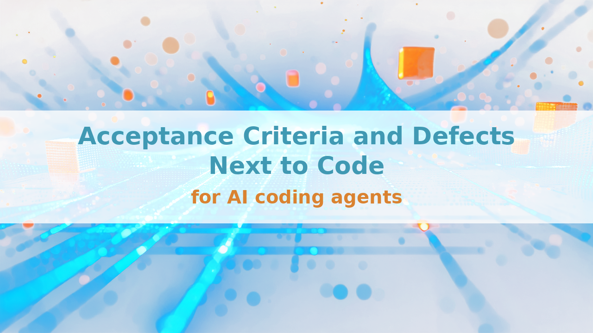


If you've worked with an AI coding agent across more than one session, you know the moment. It finds a second defect it wasn't asked to fix, or finishes a feature whose only acceptance criteria were a vague prompt from two hours earlier. Where does that go?

Three usual answers, and what each one costs:

- **Hosted tracker.** A context switch: leave the session, file it, come back
- **Notes file beside the code.** A second copy of the same facts, which drifts from the first
- **Whole tracker pasted into the agent's context.** A context window full of rows nobody asked for

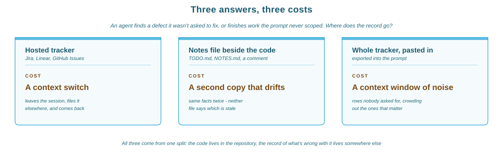

All three keep the record of what is wrong with the code in a second place: a tracker, a second copy, or the agent's context. When the code changes and that record does not, the two disagree, and nothing shows which one is out of date. The alternative is one file next to the code, readable in an editor and by a tool, used as the only record. That removes the second place. It does not remove the work of keeping the file correct.

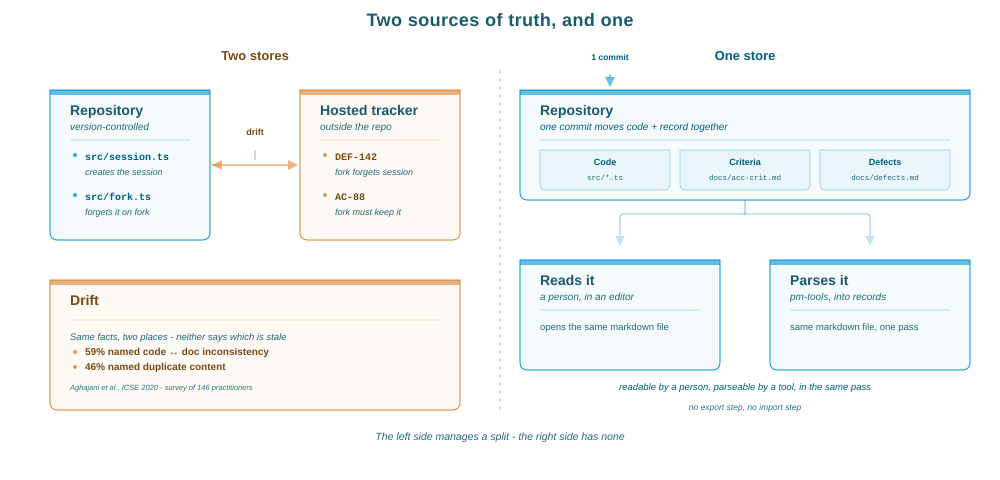

That's the **project-management** plugin for Claude Code, from the [stellarshenson/claude-code-plugins](https://github.com/stellarshenson/claude-code-plugins) marketplace, with its CLI in the `stellars-claude-code-plugins` package. It keeps two markdown files per project:

- **`docs/acc-crit-<project>.md`** - the acceptance criteria: what each change must do, and the test that shows it does
- **`docs/defects-<project>.md`** - the defects: what is broken, how to reproduce it, what was tried, and the proof it was fixed

Both files are written through `pm-tools`, a CLI with no generative step. A hand edit is legal markdown but loses the id and the log line. The tracker counts below come from the plugin's own two files.

## Quick start

```bash
/plugin marketplace add stellarshenson/claude-code-plugins
/plugin install project-management@stellarshenson-marketplace
pip install stellars-claude-code-plugins
```

"Add a criterion", "file a bug", "where do the defects stand", "is anything untestable" and "upgrade the old bug list" route to five commands: `acc-crit`, `defect`, `report`, `review` and `upgrade`.

## Who it is for

- **Developers and small teams working in one repository** - who want the requirements and the defects kept in that repository, next to the code
- **Anyone running AI coding agents over several sessions** - each new session starts without the previous session's context
- **Not teams that need an enterprise tracker** - there is no server, no web interface, no database and no permission model

It is a local project-management tool for agentic work. The requirements a change has to meet are written as acceptance criteria, what is broken is written as defects, and both files live in the repository that holds the code. When an agent writes most of the changes, those two files are what the next session reads to learn what was found, tried and proved.

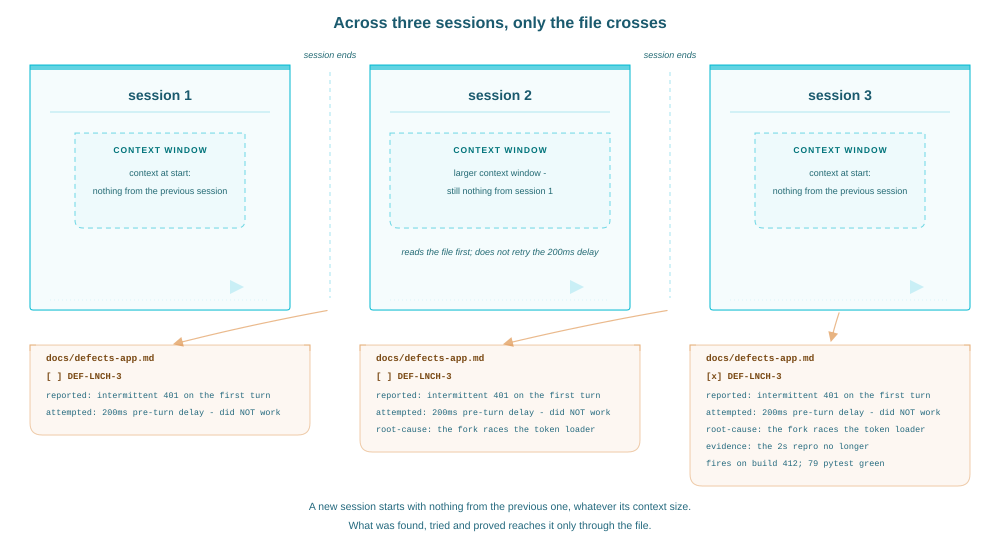

## Why it is built this way

Each design choice answers a measured problem.

| Choice | Evidence |
|---|---|
| The session that changed the code files the defect, with no context switch | 20 minutes of interrupted work raised measured stress, frustration and effort across 48 subjects ([Mark et al.](https://doi.org/10.1145/1357054.1357072), CHI 2008) |
| One source of truth, not a document plus a tracker | of 146 practitioners, 59% named code-versus-documentation inconsistency a recurring problem, 46% named duplicate content ([Aghajani et al.](https://doi.org/10.1145/3377811.3380405), ICSE 2020) |
| Markdown, read by a parser and never by a model | about 15 microseconds per item, rising linearly with the item count, never cached |
| One file for people and for the tool, no export and no import | Knuth's 1984 argument: one source, derived outputs, so they can't fall out of step ([Literate Programming](https://doi.org/10.1093/comjnl/27.2.97)) |
| The file never enters the context window; the CLI returns only the rows asked for | with the answer mid-context, GPT-3.5-Turbo scored below its own closed-book baseline of 56.1% ([Liu et al.](https://aclanthology.org/2024.tacl-1.9/), TACL 2024) |
| Short entries | mean accuracy fell from 92% to 68% by 3,000 tokens of padding ([Levy et al.](https://aclanthology.org/2024.acl-long.818/), ACL 2024); clarity still rated the top documentation issue, at 88% |
| Every event timestamped and attributed, so a git collision is resolvable | 87% of conflicting chunks across 2,731 Java projects were resolved from lines already on one side ([Ghiotto et al.](https://doi.org/10.1109/TSE.2018.2871083), IEEE TSE 2020) |

None of these papers measured this tool, and the merge study measured Java source rather than markdown checklists. Each supports a choice; none proves the tool beats the alternatives, because that comparison hasn't been run.

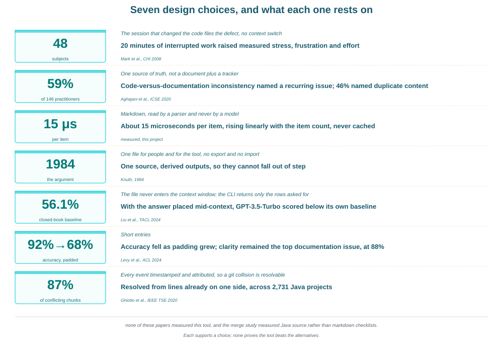


## One source of truth, down to the single fact

The rule only holds if it also holds inside the file. A tracker contradicts itself where it stores the same fact twice, so store every fact once and compute the rest at read time.

| Fact | Where it lives |
|---|---|
| Item text, title, log | the checklist line and its sub-lines |
| Evidence it is done | one `evidence:` line, written at closure |
| Why it happens, how it works | the newest `root-cause:` or `mechanism:` record |
| Open, closed or rejected | the checkbox |
| Category membership | the `##` section the line sits under |
| Next free number | not stored - highest id in the file, plus one |
| Backlinks, blocker chain | not stored - computed by `refs` |
| Contents, counts, coverage | not stored - computed by `list-categories`, `report` and `coverage` |

Three things follow. No contents table, because a hand-kept index is a second copy that drifts. No "Open" and "Fixed" sections, because status is the checkbox and an item never moves. One-way links, because the reverse side is computed and never written back.

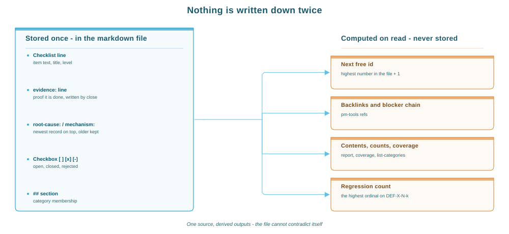

## What a defect looks like

```markdown
## Launch `LNCH`

Cold start, splash screen and the first turn after a fork

- [ ] `DEF-LNCH-3` **token race on relaunch** - MAJOR; auth token occasionally empty on the first turn after a fork; cause under investigation; `src/session.ts`
  - repro: fork under load, send a turn inside 2s
  - root-cause: 2026-08-31T09:12:44Z @kj the fork races the token loader
  - test-tags: INTEGRATION
  - related: ACC-LNCH-8 - the criterion this violates
  - log: 2026-06-22T09:14:27Z @kj reported: intermittent 401 on the first turn
  - log: 2026-06-22T11:02:55Z @kj attempted: 200ms pre-turn delay - did NOT work
```

You can read that without the tool: the state is a checkbox, the severity a word, the reproduction a sentence, the history a list of dated lines. No rendering step, no query language, no export.

**The id is permanent.** Unique, never recycled, and it survives a move to another category, because renumbering would break every commit that cites it.

**Three states, one character.** `[ ]` open, `[x]` closed, `[-]` rejected. Rejected means it was never a defect; a real one nobody will fix is closed with the reason.

**Triage is mandatory and the agent does it,** from the symptom, on the worst plausible reading, without asking. File without a severity and the CLI answers:

```
a defect must be triaged; pass --severity CRITICAL|MAJOR|MEDIUM|MINOR
```

**Every event is timestamped:** an ISO 8601 UTC stamp, the author handle, the event, appended and never rewritten. The attempts that did NOT work stay in the file - on a hunt that runs for days, what's already ruled out can't be recovered from the code, only from the log.

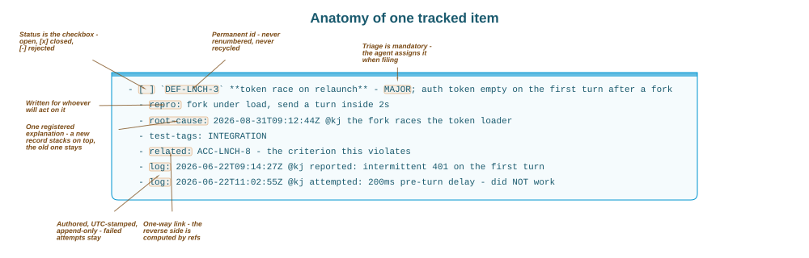

## What an acceptance criterion looks like

```markdown
## Branch Switching `BRSW`

Switching a project row between its conversation branches

- [x] `ACC-BRSW-1` **Submenu** - HIGH; row with >1 conversation JSONL shows "Switch Conversation Branch"
  - test: seed a project with 2 JSONLs, right-click the row
  - test-tags: UNIT, E2E
  - evidence: jest 43 green, submenu observed on a 2-branch project in v1.3.0
  - log: 2026-06-12T08:41:03Z @kj implemented (v1.2.2)
- [-] `ACC-BRSW-3` **Edge: branch removed before click** - MEDIUM; switch returns 404, panel shows the error and refreshes
```

Same line format, same id scheme, same three states, four differences. **One assertion per item:** if it needs "and", it's two criteria, and edge cases are their own items. **Importance instead of severity:** `CRITICAL`, `HIGH`, `MEDIUM` or `LOW`, rated as it's filed. **A `test:` hint instead of `repro:`,** plus `test-tags:` feeding a coverage grid with a `NO-TEST` column. **One `mechanism:` record,** how the behaviour is meant to work, where a defect carries `root-cause:`.

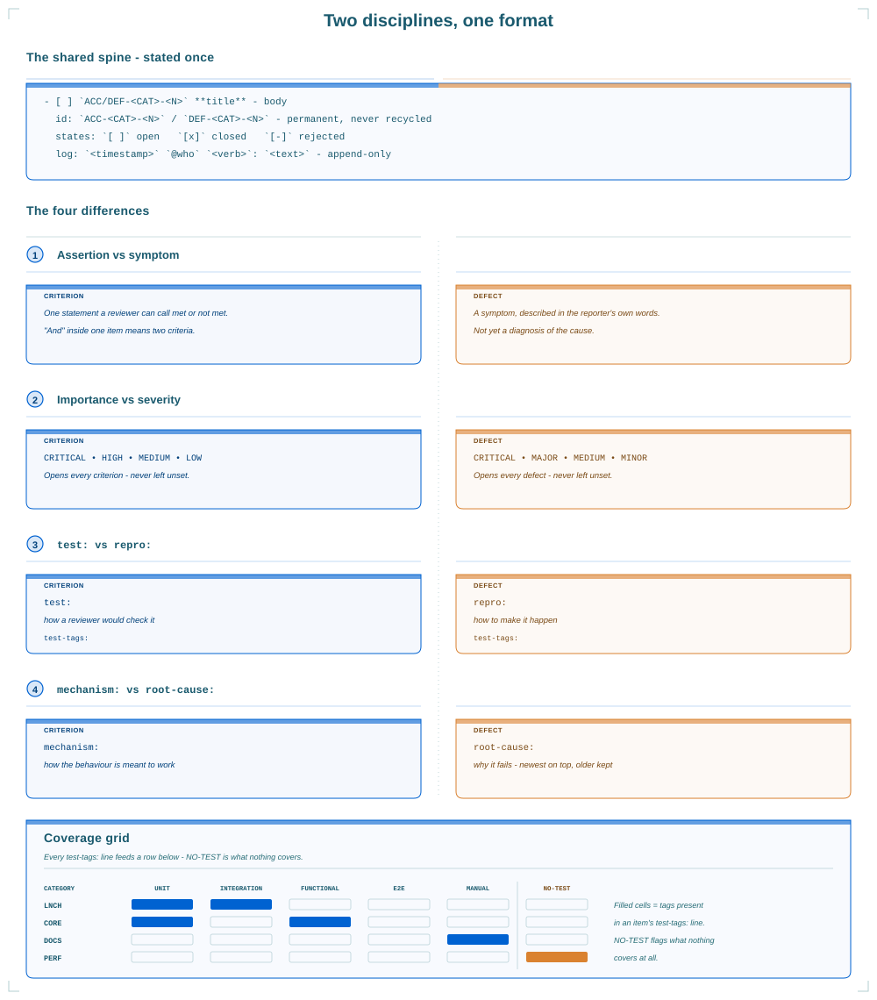

`review` runs a hostile independent review of either file: an analyst lens on criteria, a QA lens on defects.

## Closing an item requires evidence

`close` refuses to run without `--evidence`:

```
pm-tools close: error: the following arguments are required: --evidence
```

The evidence is one line saying what shows the item is done: the regression test that passes, or the build the repro no longer fires on. Writing a fix doesn't count. Running the test and recording what it printed does.

## A fix that comes back is counted, not overwritten

Reopening a closed defect opens a new item instead of flipping the box. `DEF-LNCH-3` stays closed with its evidence and `DEF-LNCH-3-1` opens beside it. Reopen that and you get `-2`, never `-1-1`, so the highest ordinal counts how often that defect has regressed. The parent stays closed because its fix was proven when it was closed, and reopening it would delete that proof.

Criteria are exempt. A reopened criterion isn't done, so its evidence line retires into the log and the box goes back to open.

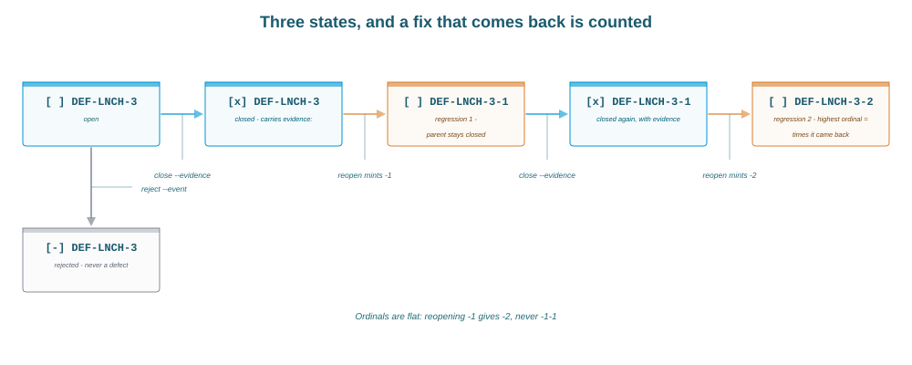

## The explanation keeps its history

A defect carries one `root-cause:` record, a criterion one `mechanism:`. A second goes above the first and keeps it, so the theory disproved on Tuesday is still readable on Friday. The top record is the current one; `--update` replaces it instead of stacking.

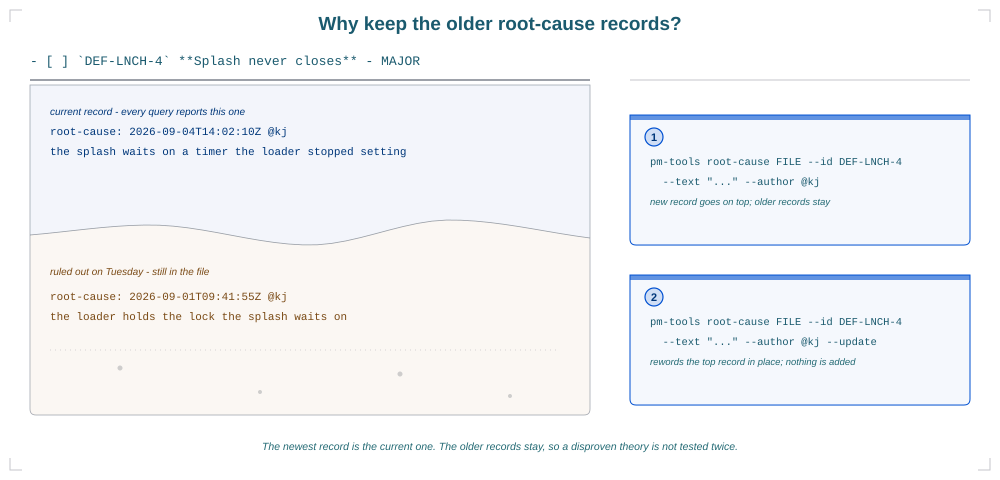

## The agent asks, the file stays on disk

In the plugin's own repository the two tracker files are 171,572 bytes. The full status report over both is 8,527 bytes; one category's is 1,300.

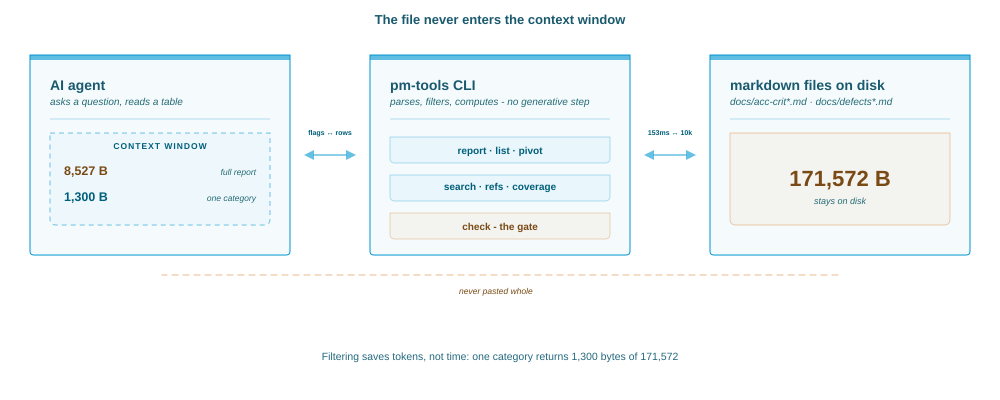

Every query is a computed table and the filters are flags:

```bash
pm-tools report docs --summary                 # the status grid and the open-by-level grid
pm-tools report docs --severity CRITICAL       # also --category, --author, --tag, --since
pm-tools list docs --status open --columns id,title,age --sort=-age
pm-tools pivot docs --rows author --cols severity
pm-tools search docs "token race"
pm-tools refs docs --id DEF-LNCH-3             # inbound, outbound and the blocker chain
pm-tools coverage docs
```

`search` ranks with BM25 and tolerates typos; `--json` returns the same facts as data.

Below a few thousand items the file isn't the cost: interpreter start is 84 ms of any call, a 1,000-defect file parses in 13.6 ms. A generated file of 10,000 criteria and 25,577 log lines parses in 153 ms and lints in 1.2 s. Filtering saves tokens rather than time: a one-category report on it parses everything either way and returns 8,436 bytes instead of 780,567.

## The gate

`check` is the only gate and exits non-zero on errors: a duplicate id, an untriaged defect, an unrated criterion, a hand-kept contents table, a dangling relation, a blocked-by cycle. `--strict` also fails on warnings.

Against the plugin's own trackers today: 0 errors, 39 warnings, a `--strict` fail. 15 are defects with no test tag; the other 24 come from 15 early criteria, all missing a test hint, 9 of them closed before the evidence line existed. The trackers are held to the same check as anyone's, and the warnings say where the debt is.

## Bringing in a list you already have

Most projects have one already: a bug list in a markdown file, a requirements document, review notes that never became items. `pm-tools upgrade` rebuilds one in place - ids, category codes, dated notes into timestamped `log:` lines, canonical severity words, upper-cased tags, contents table deleted. Dry run first, then `--author @kj --apply`:

```
line 8: category 'Launch' -> code `LAUNCH`
line 16: category 'Branch Switching' -> code `BRANCH`
line 10: (no id) -> DEF-LAUNCH-4
line 13: DEF-3 -> DEF-LAUNCH-3
line 18: (no id) -> DEF-BRANCH-5
line 3: drop the ## Contents section (index is derived)
3 dated note(s) -> `- log: <stamp> ...`
3 date-only stamp(s) -> ISO 8601 UTC at 00:00:00Z
1 test-tags line(s) upper-cased
severity renamed: P1 -> MAJOR x1, URGENT -> CRITICAL x1

dry run: 10 change(s), 12 hint(s). Re-run with --apply
```

`BLOCKER`, `URGENT`, `P0` and `S1` become `CRITICAL`; `HIGH`, `P1` and `S2` become `MAJOR`, and so on down. A word outside that map isn't guessed at - it becomes a hint, and so does everything else the file can't answer:

```
HINT line 8: category 'Launch' has no description; run: pm-tools describe defects-app.md --category LAUNCH --text "<one line>"
HINT line 18: DEF-BRANCH-5 carries an unmapped severity word 'WISHLIST'; run: pm-tools edit defects-app.md --id DEF-BRANCH-5 --severity CRITICAL|MAJOR|MEDIUM|MINOR
```

A category description, a repro hint, an evidence line, a criterion's importance: none is derivable from a legacy file, so the tool invents none of them. It applies every rewrite that does follow, exits 0, and prints one hint per remaining problem carrying the command that clears it. The agent works down the list, and the migration is finished when `check` exits 0. That is how the work divides everywhere in the plugin: the deterministic half does what can be derived, the judgement goes to the agent.

Old numbers survive. A legacy `DEF-3` becomes `DEF-LAUNCH-3`, so a commit citing `DEF-3` still reads true, and a legacy date with no time lands at `00:00:00Z`.

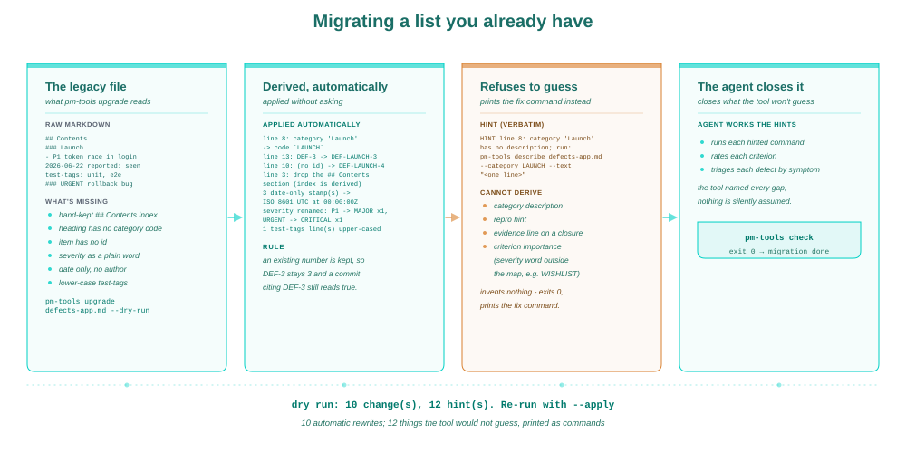

## The rules make the agent pedantic

The rules discipline the operator, and the operator is usually an agent. It can't close without `--evidence`, so it runs the test and records what printed. It can't file without a severity, so it triages when it reads the symptom. It can't retire a closure by reopening one. Each is a flag the CLI refuses to run without, which is why the discipline survives a change of session or model.

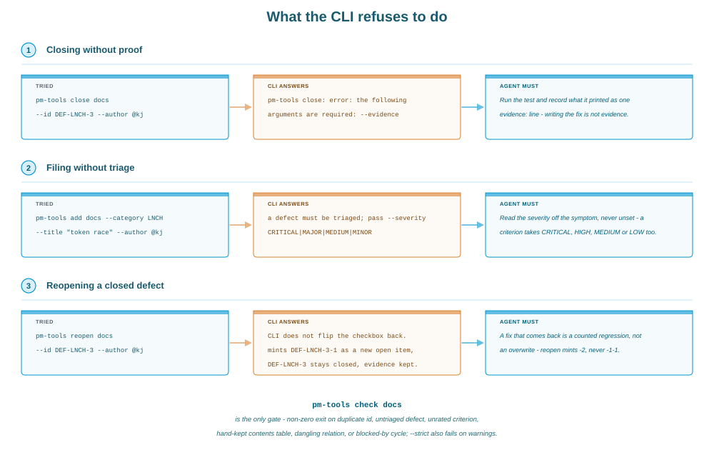

## Two people, one file

A team is handled by recording rather than by locking. Every log line carries a UTC timestamp and an author handle and is appended, never rewritten, so the order of events sits in the file rather than in a server you have to ask. Working out who did what, and when, is a reading task.

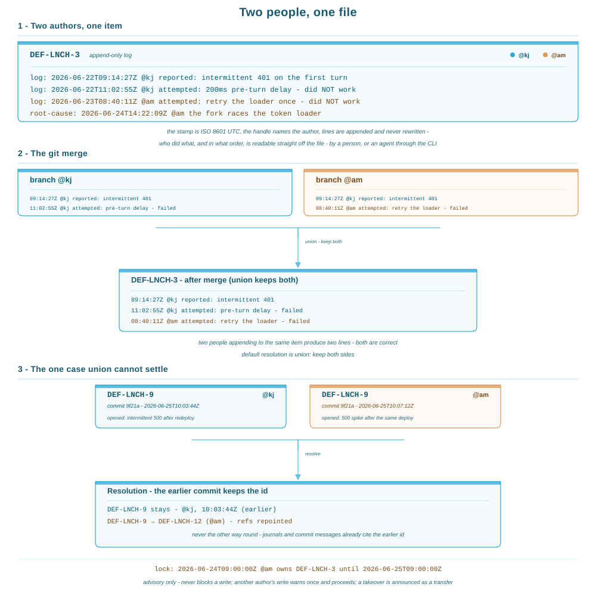

Items never move and logs only grow, so the default git resolution is union: keep both sides, and two people appending produce two lines that are both correct. Union can't settle two people filing the same id against the same commit - the earlier commit keeps it, the later item is renumbered and its inbound references repointed, because commits already cite the earlier id.

An open item can also carry a **soft lock**: one `lock:` line naming who's on it and until when, 24 hours by default. It never blocks a write; another author's write warns once and proceeds.

## Results

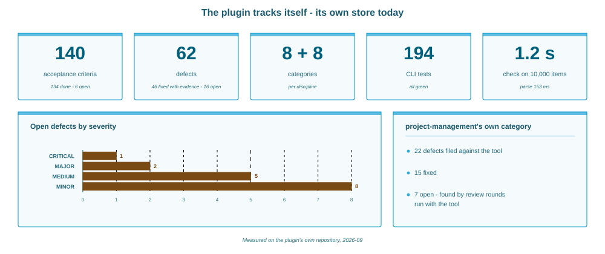

The plugin tracks itself: 140 acceptance criteria and 62 defects across 8 categories each. Of the defects, 46 are closed with evidence and 16 open - 1 `CRITICAL`, 2 `MAJOR`, 5 `MEDIUM`, 8 `MINOR`. The project-management category holds 22 of them, 15 fixed. The CLI is covered by 194 tests, all passing.

What surprised me is how much of the design follows from the evidence rule and the regression rule together. Once a closure carries evidence and reopening can't delete it, the file becomes a record of what was true and when.

## Limitations

- No assignment, no workflow beyond three states, no notifications, no dashboard anyone outside the repo can open
- A hand edit that breaks the line format is caught by `check`; one that keeps the format and changes the meaning is not
- The parse-time figures are from one machine and one generated file; the milliseconds are indicative
- The lock is advisory. Two people on the same item are told, not prevented

## When to use it

Use it when the engineering history - failed attempts, root-cause records, evidence - should live next to the code, beside a hosted tracker rather than instead of one. Not as a customer-facing queue, a roadmap, or anything needing a permission model.

## The rule is the point

One source of truth per discipline, one file next to the code, readable by a person and parseable by a tool, every fact stored once and every derived fact computed on read. Nothing in it is novel: the format is a checklist, the storage is a markdown file, the ordering is a timestamp. It works because a tool enforces the rules instead of whoever is at the keyboard remembering them. If your agent keeps losing track of what it found, tried and proved, a bigger context window won't fix that.

<!-- marks:settings panel=minimap -->
